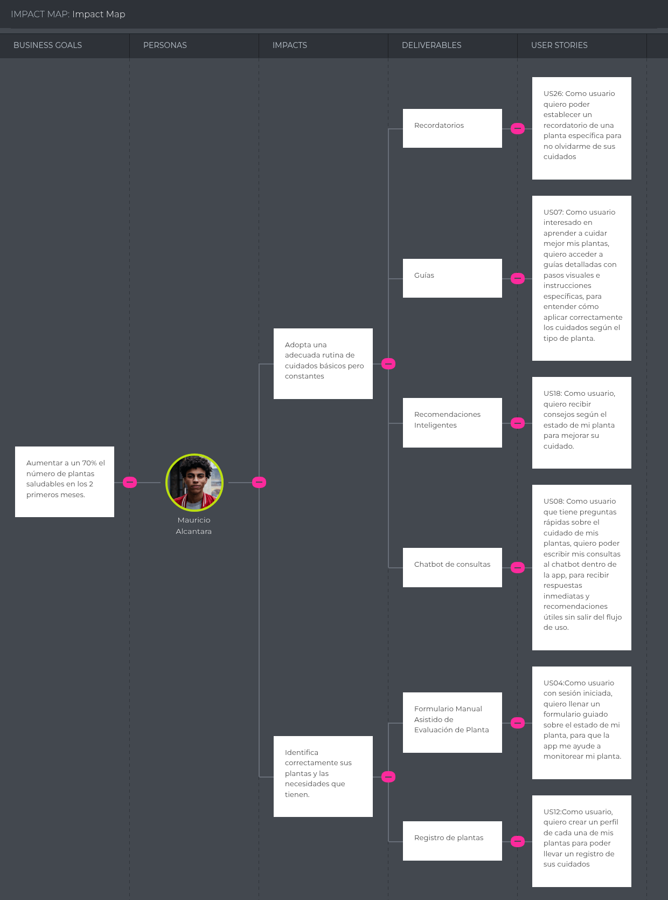
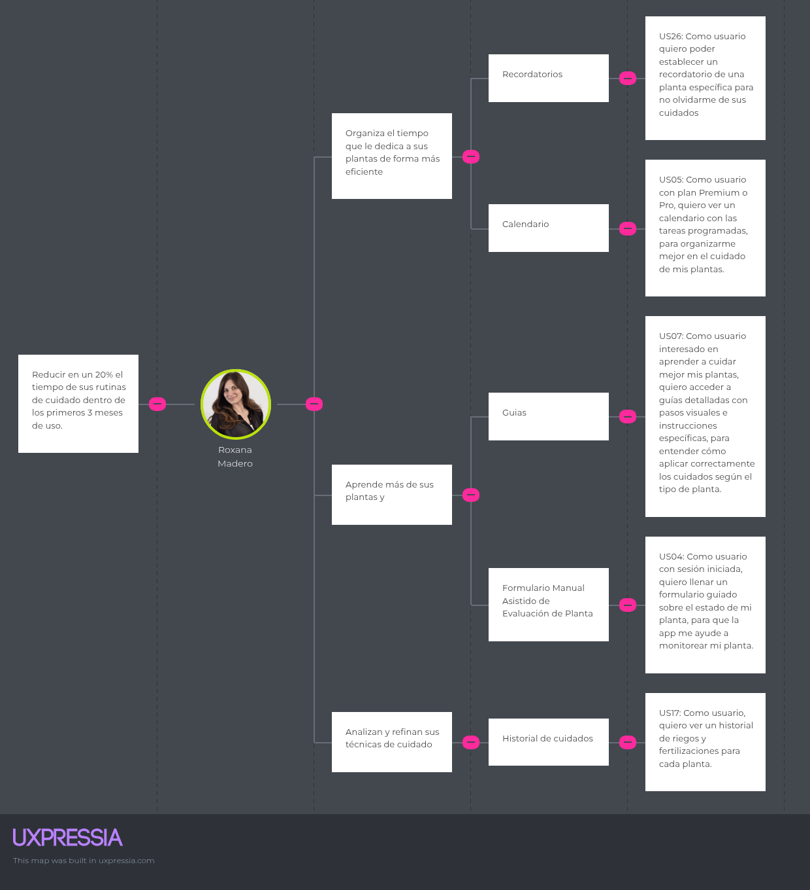
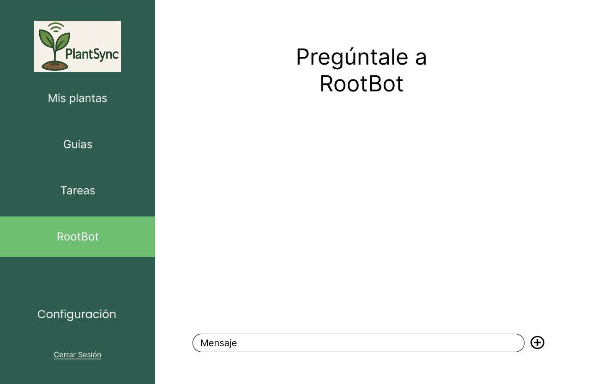

<h1 align="center">Informe de Trabajo Final</h1>

<p align="center">
  
</p>

**Universidad Peruana de Ciencias Aplicadas**

**Ingeniería de Software**

**5to Ciclo**

**Código del curso:** 1ASI0729

**Nombre del curso:** Desarrollo de aplicaciones Open Source

**Sección:** 4289

**Nombre del profesor:** BAUTISTA UBILLUS, EFRAIN RICARDO

**Nombre del Startup:** BioPafi

**Nombre del Producto:** PlantSync

### Relación de Integrantes

| **Código** | **Apellidos y Nombres**             |
| ---------- | ----------------------------------- |
| U20231A500 | Palomino Fiestas, Erick Leonardo    |
| U202312966 | Gonzales Alvarado, Javier Sebastian |
| U202121947 | Palomares Andrade, Sean Farith      |
| U20231D974 | Rivera Ratachi, Renzo Sebastian     |
| U202311601 | Torres Apolinario, Giovany Smith    |

**Abril 2025**

---

## Registro de Versiones del Informe

<table align="center">
  <tr>
    <td><strong>Versión</strong></td>
    <td><strong>Fecha</strong></td>
    <td><strong>Autor(es)</strong></td>
    <td><strong>Descripción de cambios</strong></td>
  </tr>
    <tr>
    <td>1.0</td>
    <td>06/04/23</td>
    <td>
    Palomino,<br>
    Gonzales,<br>
    Rivera,<br>
    Palomares, Torres
    </td>
    <td>Creación del documento en repositorio compartido en GitHub</td>
  </tr>
  </tr>
  <tr>
    <td>1.1</td>
    <td>9/04/23</td>
    <td>
    Palomino,<br>
    Gonzales,<br>
    Rivera,<br>
    Palomares, Torres
    </td>
    <td>Realizacion del Startup Profile, Perfiles de integrantes del equipo y Antecedentes y Problematicas </td>
  </tr>
  <tr>
    <td>1.2</td>
    <td>10/04/23</td>
    <td>
    Gonzales,<br>
    Palomares
    </td>
    <td>Realizacion del Lean UX Procces</td>
  </tr>
  <tr>
    <td>1.3</td>
    <td>12/04/23</td>
    <td>
    Renzo<br>
    </td>
    <td>Realización de Competidores, analisis y estrategias</td>
  </tr>
  <tr>
    <td>1.4</td>
    <td>14/04/23</td>
    <td>
    Palomino,<br>
    Gonzales,<br>
    Rivera,<br>
    Palomares, Torres
    </td>
    <td>Realizacion de diseño de entrevistas, registro y analisis</td>
  </tr>
  <tr>
    <td>1.5</td>
    <td>15/04/23</td>
    <td>
    Rivera,<br>
    Torres
    </td>
    <td>Realización del Needfinding segun las entrevistas</td>
  </tr>
  <tr>
    <td>1.6</td>
    <td>17/04/23</td>
    <td>
    Palomino,<br>
    Gonzales,<br>
    Rivera,<br>
    Palomares, Torres
    </td>
    <td>Realización de los to-be scenario Mapping, User Stories, Impact Mapping y Product Backlog</td>
  </tr>
  <tr>
    <td>1.7</td>
    <td>18/04/23</td>
    <td>
    Palomino,<br>
    Gonzales
    </td>
    <td>Realización de los style guidelines y Information Architecture</td>
  </tr>
  <tr>
    <td>1.9</td>
    <td>24/04/23</td>
    <td>
    Palomino,<br>
    Gonzales,<br>
    Rivera,<br>
    Palomares, Torres
    </td>
    <td>Realización de la Landing Page UI Desing, Web Application UX/UI Desing, Web Application Prototyping, Domain Driven Software Architecture, Class Diagram, Database Diagram</td>
  </tr>
  <tr>
    <td>1.10</td>
    <td>26/04/23</td>
    <td>
    Palomino,<br>
    Gonzales,<br>
    Rivera,<br>
    Palomares, Torres
    </td>
    <td>Realización del Software Configuration Managmente, Landing Page, Service & Application Implementation, Sprint 1 y Conclusiones</td>
  </tr>
</table>

---

## Project Report Collaboration Insights

## **TB1**

<table align="center">
  <tr>
    <td><strong>Integrante</strong></td>
    <td><strong>Tareas Asignadas</strong></td>
  </tr>
  <tr>
    <td>
      Erick Palomino
    </td>
    <td>
      Startup Profile, Style Guidelines, User Stories, Landing Page UI Desing, Web Application Prototyping, Landing Page Code.
    </td>
  </tr>
  <tr>
    <td>
      Javier Gonzales
    </td>
    <td>
      Lean Ux Problem Statement, Assumptions, Desarrollo de entrevistas, Arquitectura de informacion, Wireframes y Wireflows, Desarrollo de la Landing Page
    </td>
  </tr>
  <tr>
    <td>
      Renzo Rivera
    </td>
    <td>
      Competitive Analysis, User Personas, User Journey Mapping, User Task Matrix, User Stories, User Flow Diagrams, Plan Section Landing Page
    </td>
  </tr>
  <tr>
    <td>
      Sean Palomares
    </td>
    <td>
     Lean UX Hypothesis Statements y Canvas, Segmentos Objetivo, To-Be Scenario Mapping, Impact Mapping, Product Backlog, Software Object-Oriented Design, Database Design, Software Configuration Management
    </td>
  </tr>
  <tr>
    <td>
      Giovany Torres
    </td>
    <td>
      Antecedentes y Problemática, Empathy Mapping , As-is scenario mapping, Ubiquitous Language, Domain driven software architecture, Sprint planning 1, Sprint Backlog 1, Landing page, Conclusiones
    </td>
  </tr>
</table>

---

## Contenido

- [Student Outcome](#student-outcome)
- [Capítulo I: Introducción](#capítulo-i-introducción)

  - [1.1. Startup Profile](#11-startup-profile)
    - [1.1.1. Descripción de la Startup](#111-descripción-de-la-startup)
    - [1.1.2. Perfiles de integrantes del equipo](#112-perfiles-de-integrantes-del-equipo)
  - [1.2. Solution Profile](#12-solution-profile)
    - [1.2.1. Antecedentes y problemática](#121-antecedentes-y-problemática)
    - [1.2.2. Lean UX Process](#122-lean-ux-process)
      - [1.2.2.1. Lean UX Problem Statements](#1221-lean-ux-problem-statements)
      - [1.2.2.2. Lean UX Assumptions](#1222-lean-ux-assumptions)
      - [1.2.2.3. Lean UX Hypothesis Statements](#1223-lean-ux-hypothesis-statements)
      - [1.2.2.4. Lean UX Canvas](#1224-lean-ux-canvas)
  - [1.3. Segmentos objetivo](#13-segmentos-objetivo)

- [Capítulo II: Requirements Elicitation & Analysis](#capítulo-ii-requirements-elicitation--analysis)

  - [2.1. Competidores](#21-competidores)

    - [2.1.1. Análisis competitivo](#211-análisis-competitivo)
    - [2.1.2. Estrategias y tácticas frente a competidores](#212-estrategias-y-tácticas-frente-a-competidores)

  - [2.2. Entrevistas](#22-entrevistas)
    - [2.2.1. Diseño de entrevistas](#221-diseño-de-entrevistas)
    - [2.2.2. Registro de entrevistas](#222-registro-de-entrevistas)
    - [2.2.3. Análisis de entrevistas](#223-análisis-de-entrevistas)
  - [2.3. Needfinding](#23-needfinding)
    - [2.3.1. User Personas](#231-user-personas)
    - [2.3.2. User Task Matrix](#232-user-task-matrix)
    - [2.3.3. User Journey Mapping](#233-user-journey-mapping)
    - [2.3.4. Empathy Mapping](#234-empathy-mapping)
    - [2.3.5. As-is Scenario Mapping](#235-as-is-scenario-mapping)
  - [2.4. Ubiquitous Language](#24-ubiquitous-language)

- [Capítulo III: Requirements Specification](#capítulo-iii-requirements-specification)

  - [3.1. To-Be Scenario Mapping](#31-to-be-scenario-mapping)
  - [3.2. User Stories](#32-user-stories)
  - [3.3. Impact Mapping](#33-impact-mapping)
  - [3.4. Product Backlog](#34-product-backlog)

- [Capítulo IV: Product Design](#capítulo-iv-product-design)

  - [4.1. Style Guidelines](#41-style-guidelines)
    - [4.1.1. General Style Guidelines](#411-general-style-guidelines)
    - [4.1.2. Web Style Guidelines](#412-web-style-guidelines)
  - [4.2. Information Architecture](#42-information-architecture)
    - [4.2.1. Organization Systems](#421-organization-systems)
    - [4.2.2. Labeling Systems](#422-labeling-systems)
    - [4.2.3. SEO Tags and Meta Tags](#423-seo-tags-and-meta-tags)
    - [4.2.4. Searching Systems](#424-searching-systems)
    - [4.2.5. Navigation Systems](#425-navigation-systems)
  - [4.3. Landing Page UI Design](#43-landing-page-ui-design)
    - [4.3.1. Landing Page Wireframe](#431-landing-page-wireframe)
    - [4.3.2. Landing Page Mock-up](#432-landing-page-mock-up)
  - [4.4. Web Applications UX/UI Design](#44-web-applications-uxui-design)
    - [4.4.1. Web Applications Wireframes](#441-web-applications-wireframes)
    - [4.4.2. Web Applications Wireflow Diagrams](#442-web-applications-wireflow-diagrams)
    - [4.4.3. Web Applications Mock-ups](#443-web-applications-mock-ups)
    - [4.4.4. Web Applications User Flow Diagrams](#444-web-applications-user-flow-diagrams)
  - [4.5. Web Applications Prototyping](#45-web-applications-prototyping)
  - [4.6. Domain-Driven Software Architecture](#46-domain-driven-software-architecture)
    - [4.6.1. Software Architecture Context Diagram](#461-software-architecture-context-diagram)
    - [4.6.2. Software Architecture Container Diagrams](#462-software-architecture-container-diagrams)
    - [4.6.3. Software Architecture Components Diagrams](#463-software-architecture-components-diagrams)
  - [4.7. Software Object-Oriented Design](#47-software-object-oriented-design)
    - [4.7.1. Class Diagrams](#471-class-diagrams)
    - [4.7.2. Class Dictionary](#472-class-dictionary)
  - [4.8. Database Design](#48-database-design)
    - [4.8.1. Database Diagram](#481-database-diagram)

- [Capítulo V: Product Implementation, Validation & Deployment](#capítulo-v-product-implementation-validation--deployment)

  - [5.1. Software Configuration Management](#51-software-configuration-management)
    - [5.1.1. Software Development Environment Configuration](#511-software-development-environment-configuration)
    - [5.1.2. Source Code Management](#512-source-code-management)
    - [5.1.3. Source Code Style Guide & Conventions](#513-source-code-style-guide--conventions)
    - [5.1.4. Software Deployment Configuration](#514-software-deployment-configuration)
  - [5.2. Landing Page, Services & Applications Implementation](#52-landing-page-services--applications-implementation)
    - [5.2.1. Sprint 1](#521-sprint-1)
      - [5.2.1.1. Sprint Planning 1](#5211-sprint-planning-1)
      - [5.2.1.2. Aspect Leaders and Collaborators](#5212-aspect-leaders-and-collaborators)
      - [5.2.1.3. Sprint Backlog 1](#5213-sprint-backlog-1)
      - [5.2.1.4. Development Evidence for Sprint Review](#5214-development-evidence-for-sprint-review)
      - [5.2.1.5. Execution Evidence for Sprint Review](#5215-execution-evidence-for-sprint-review)
      - [5.2.1.6. Services Documentation Evidence for Sprint Review](#5216-services-documentation-evidence-for-sprint-review)
      - [5.2.1.7. Software Deployment Evidence for Sprint Review](#5217-software-deployment-evidence-for-sprint-review)
      - [5.2.1.8. Team Collaboration Insights during Sprint](#5218-team-collaboration-insights-during-sprint)

- [Conclusiones y Recomendaciones](#conclusiones-y-recomendaciones)
- [Bibliografía](#bibliografía)
- [Anexos](#anexos)

---

## Student Outcome

<table align="center">
  <tr>
    <td><strong>Criterio</strong></td>
    <td><strong>Acciones Realizadas</strong></td>
    <td><strong>Conclusiones</strong></td>
  </tr>
  <tr>
    <td>
      Comunica oralmente con efectividad a diferentes rangos de audiencia.
    </td>
    <td>
      <strong>Erick Palomino:</strong>
      TB1 - Participación en la presentación oral de la propuesta inicial del proyecto, explicación de Startup Profile y Lineamientos de Estilo.
      <br><br>
      <strong>Javier Gonzales:</strong>
      TB1 - Presentación oral de los resultados de entrevistas y de la estructura de la Landing Page.
      <br><br>
      <strong>Renzo Rivera:</strong>
      TB1 – Exposición de análisis competitivo y explicación de los User Flow Diagrams durante la reunión grupal.
      <br><br>
      <strong>Sean Palomares:</strong>
      TB1 - Explicación oral de los mapas de impacto y segmentación de objetivos en reuniones grupales.
      <br><br>
      <strong>Giovany Torres</strong>
      TB1 –  Presentación oral de los antecedentes, problemática y mapeos de escenarios en el desarrollo inicial del proyecto.
    </td>
    <td>
      Como grupo, logramos una comunicación oral efectiva que facilitó la comprensión de las distintas etapas del proyecto. La coordinación de presentaciones y la exposición clara de ideas fortalecieron nuestro trabajo en equipo y permitieron que cada integrante aportara de forma precisa en su área asignada.
    </td>
  </tr>
  <tr>
    <td>
      Comunica por escrito con efectividad a diferentes rangos de audiencia 
    </td>
    <td>
      <strong>Erick Palomino:</strong>
      TB1 – Redacción del Startup Profile, Style Guidelines, User Stories y contenido de la Landing Page.
      <br><br>
      <strong>Javier Gonzales:</strong>
      TB1 –  Redacción del Lean UX Problem Statement, Assumptions y desarrollo de wireframes documentados.
      <br><br>
      <strong>Renzo Rivera:</strong>
      TB1 –  Documentación escrita de análisis competitivo, User Personas, User Journey Mapping y Task Matrix.
      <br><br>
      <strong>Sean Palomares:</strong>
      TB1 – Elaboración escrita de Hypothesis Statements, Product Backlog y base de diseño orientado a objetos.
      <br><br>
      <strong>Giovany Torres:</strong>
      TB1 –  Redacción de antecedentes, problemática, Empathy Mapping y documentos de arquitectura de software, incluyendo la conclusión escrita del reporte.
    </td>
    <td>
      Como equipo, fuimos capaces de producir documentos escritos claros y adaptados al público objetivo, asegurando la coherencia y calidad de la información entregada. Esto facilitó la comprensión del proyecto tanto para el equipo como para los revisores externos. El trabajo colaborativo en los entregables escritos fue clave para mantener una línea de comunicación efectiva en todo el desarrollo del proyecto.
    </td>
  </tr>
</table>

---

## Capítulo I: Introducción

### 1.1. Startup Profile

#### 1.1.1. Descripción de la Startup

Nuestra startup, BioPafi, nace con el propósito de brindar soluciones innovadoras para el cuidado de plantas en el hogar y con ello impulsando un cambio ambiental, combinando el poder las ultimas tecnologias. Nuestro primer producto es PlantSync, una aplicación web y móvil que permite a los usuarios monitorear el estado de sus plantas de interior, registrarlas, recibir notificaciones de riego y fertilización, acceder a guías de cuidado y hasta identificar plantas mediante fotos.

**Visión:**

En 5 años, convertirnos en líderes en tecnología ambiental aplicada al hogar en América Latina, destacándonos por la calidad, accesibilidad e innovación de nuestros productos y servicios.

**Misión:**

Facilitar el cuidado de plantas en el hogar mediante soluciones tecnológicas inteligentes, contribuyendo al bienestar ambiental y al fortalecimiento del vínculo de las personas con la naturaleza.

#### 1.1.2. Perfiles de integrantes del equipo

| **Foto del Integrantes**                                                           | **Nombres y Apellidos**            | **Código de estudiante** | **Conocimientos técnicos y habilidades**                                                                                                                                                                                                                                                                                                                                                                                         |
| ---------------------------------------------------------------------------------- | ---------------------------------- | ------------------------ | -------------------------------------------------------------------------------------------------------------------------------------------------------------------------------------------------------------------------------------------------------------------------------------------------------------------------------------------------------------------------------------------------------------------------------- |
|  | Erick Leonardo Palomino Fiestas    | U20231A500               | Hola, Soy Erick Leonardo Palomino Fiestas, un estudiante entusiasta de quinto ciclo en Ingeniería de Software. Mi conjunto de habilidades técnicas incluye C++, HTML, CSS, fundamentos de JavaScript y experiencia con bases de datos SQL y MongoDB. Me considero una persona responsable, con sólidas habilidades de comunicación para trabajar en equipo y una perspectiva optimista. También tengo un nivel básico de inglés. |
|          | Javier Sebastian Gonzales Alvarado | U202312966               | Mi nombre es Javier Gonzales, soy estudiante de la carrera Ingeniería de Software. Mi código es U202312966. Tengo conocimientos en los lenguajes C++ y Java. Además me considero una persona responsable y disponible para ayudar a los demás si presentan dificultades.                                                                                                                                                         |
|             | Sean Farith Palomares Andrade      | U202121947               | Soy Sean Palomares, estudiante de sexto ciclo de la carrera de Ciencias de la Computación. Me interesan los temas de desarrollo de software y machine learning. Tengo conocimiento en Python, C++ y C#. Estoy emocionado por colaborar con el grupo para lograr completar nuestro proyecto.                                                                                                                                      |
|              | Renzo Sebastian Rivera Ratachi     | U20231D974               | Soy Renzo Sebastian Rivera Ratachi y soy estudiante de la carrera de Ingeniería de Software. Actualmente estoy cursando el 5to ciclo de mi carrera y tengo conocimientos intermedios de HTML, CSS, JavaScript y C++. Me considero una persona responsable y puntual.                                                                                                                                                             |
|         | Giovany Smith Torres Apolinario    | U202311601               | Estoy cursando el quinto ciclo de mi carrera Ingeniería de Software, soy una persona responsable que le gusta resolver desafíos a la par con el trabajo responsable y en equipo tengo la capacidad de líder y me gusta aprender nuevas cosas dia a dia.                                                                                                                                                                          |


### 1.2. Solution Profile

En esta sección se detalla el perfil de nuestra solución, desarrollada de manera progresiva bajo el enfoque Lean UX y respaldada por fundamentos sólidos. PlantSync es una aplicación creada para facilitar el cuidado responsable de las plantas, utilizando como herramienta central un chatbot inteligente.

A través de la plataforma, los usuarios pueden registrar sus plantas y recibir asistencia personalizada. El chatbot ha sido entrenado con una base de datos construida por nuestro equipo, la cual reúne información confiable extraída de libros y fuentes científicas especializadas en botánica. Gracias a este conocimiento, el chatbot es capaz de identificar las necesidades específicas de cada planta en función de los datos proporcionados por el usuario —como fotos y detalles del entorno— y ofrecer recomendaciones prácticas para su cuidado. Además, puede detectar señales comunes de deterioro y proponer soluciones adecuadas de forma clara y accesible. PlantSync también incluye un sistema de recordatorios automáticos enviados por correo electrónico, que notifica al usuario sobre los cuidados pendientes o recurrentes de cada planta, asegurando un seguimiento constante y personalizado. De esta forma, promovemos una experiencia más organizada, intuitiva y efectiva para el manejo diario de las plantas.

#### 1.2.1. Antecedentes y problemática

Según un artículo de AGRONEGOCIOS (Gutiérrez, A. 2021), uno de los errores más comunes entre quienes recién empiezan a cuidar plantas es el riego excesivo. Los expertos advierten que usar demasiada agua es una de las formas más rápidas de dañar o incluso matar una planta de interior. Otro error frecuente es olvidar que las plantas también necesitan nutrientes, ya que muchas personas creen que solo el agua basta, cuando en realidad es importante fertilizarlas adecuadamente.

Por eso, desde BioPafi queremos apoyar a quienes desean mejorar el cuidado de sus plantas. Nuestra plataforma web permite a los usuarios registrar las plantas que tienen en casa y recibir una guía de cuidados personalizada según el tipo de planta. Además, generamos recordatorios para tareas clave como riego, fertilización y poda, y contamos con un chatbot que ofrece consejos específicos para cada planta registrada, ayudando así a mantenerlas sanas y bien cuidadas.

Who? (¿Quién?)
La solución está dirigida a personas que desean cuidar plantas de forma responsable, especialmente principiantes, aficionados, familias, adultos mayores, estudiantes y profesionales que buscan una guía confiable sin complicaciones técnicas. También es útil para emprendedores de viveros, tiendas de jardinería o diseñadores de interiores con proyectos verdes.

What? (¿Qué?)
PlantSync es una aplicación web con un chatbot inteligente entrenado en botánica, que ofrece asistencia personalizada, recomendaciones prácticas y recordatorios automáticos para el cuidado de plantas, ayudando a prevenir errores comunes y promoviendo una jardinería consciente y sostenible.

Where? (¿Dónde?)
El proyecto se implementará inicialmente en Perú, con foco en áreas urbanas como Lima Metropolitana, donde existe una alta concentración de usuarios digitales interesados en el cuidado del hogar. A mediano plazo, se contempla su expansión a otros países de América Latina, comenzando por México, Colombia y Chile, donde hay un mercado emergente con características similares.

When? (¿Cuándo?)
El diseño conceptual y la validación inicial comenzaron en abril de 2025. Actualmente nos encontramos en fase de desarrollo del prototipo funcional (MVP). Se espera una versión beta para julio de 2025, la cual será sometida a pruebas con usuarios reales. El lanzamiento oficial está previsto para noviembre de 2025, con actualizaciones progresivas durante 2026 para incorporar nuevas funciones.

Why? (¿Por qué?)
Porque muchas personas desean cuidar mejor sus plantas, pero carecen del conocimiento, del tiempo o de una guía adecuada para hacerlo, segun (SERPAR, 2021) Regar las plantas ayuda en su crecimiento y a mantenerlas sanas, previniendo enfermedades y daños provocados por insectos.Y esto lleva al deterioro de sus plantas, frustración y abandono del hábito. PlantSync responde a esta necesidad con una propuesta innovadora, educativa y automatizada, que convierte el proceso de cuidado en una experiencia agradable, accesible y sostenible.

How? (¿Cómo?)
La solución se desarrolla aplicando el enfoque Lean UX y metodologías ágiles. Se basa en tecnologías como React para el frontend, Firebase para la gestión de usuarios y base de datos en tiempo real, y un sistema de Machine Learning entrenado con TensorFlow para el análisis de imágenes de las plantas. Además, se ha integrado un modelo de procesamiento de lenguaje natural (NLP) que permite al chatbot entender las preguntas de los usuarios y responder con claridad y empatía.

How much? (¿Cuánto?)
A continuación, se detalla el presupuesto estimado para el desarrollo y lanzamiento de PlantSync:

Fase 1 – Prototipo funcional (UX/UI, MVP):
■ Diseño de experiencia de usuario, mockups y desarrollo básico de la app: $5,000

Fase 2 – Desarrollo completo e integración IA:
■ Entrenamiento del chatbot, integración de la base de datos botánica y análisis de imágenes: $12,000

Fase 3 – Infraestructura, despliegue y marketing inicial:
■ Hosting, dominio, correos automáticos, campañas de lanzamiento: $3,000

Mantenimiento y soporte anual estimado:
■ Actualizaciones, feedback de usuarios, escalabilidad: $2,000

Total estimado: $22,000 USD

Resumen:

Existe una brecha significativa entre el deseo de las personas por tener plantas sanas y su conocimiento real sobre cómo cuidarlas. Errores comunes como el riego inadecuado, la falta de nutrientes o la escasa exposición a la luz natural provocan que muchas plantas mueran innecesariamente. Esta situación genera frustración y desmotiva a quienes buscan un estilo de vida más natural y saludable. PlantSync nace como respuesta a esta problemática, ofreciendo una herramienta digital intuitiva y confiable que guía al usuario en cada paso del proceso de cuidado, con el objetivo de reducir la tasa de muerte de plantas, fomentar el aprendizaje botánico y promover una cultura de sostenibilidad desde el hogar.

#### 1.2.2. Lean UX Process

##### 1.2.2.1. Lean UX Problem Statements

El propósito de BioPafi es ofrecer a los hogares peruanos una solución tecnológica amigable que permita monitorear de manera inteligente el estado de las plantas a través de sensores conectados a una plataforma web. Esta solución está dirigida a personas con plantas en casa, quienes desean cuidarlas pero no siempre cuentan con los conocimientos técnicos, el tiempo o los recursos para hacerlo de forma precisa.

El problema se presenta en el momento en que los usuarios deben tomar decisiones sobre el cuidado de sus plantas, como regarlas, moverlas de lugar o protegerlas del clima sin contar con información confiable y en tiempo real sobre su estado. Esta falta de datos conlleva a un cuidado improvisado, que muchas veces resulta en el deterioro de las plantas por exceso o falta de agua, condiciones ambientales inadecuadas, o incluso enfermedades que no son detectadas a tiempo. Actualmente, muchas personas dependen de la observación visual, el tacto o simples aplicaciones de recordatorios, lo que genera márgenes de error significativos en el mantenimiento de sus plantas.

Hemos identificado que esta incertidumbre en el cuidado de las plantas genera frustración, pérdida de tiempo, y en muchos casos, abandono del hábito de jardinería. Esta problemática se intensifica en ambientes urbanos donde las condiciones de iluminación, temperatura, y humedad varían mucho en espacios pequeños.

A todo esto nos surge la pregunta: ¿Cómo podríamos brindar a las personas una solución inteligente y automatizada que monitoree el estado de sus plantas, brinde alertas de cuidado y recomendaciones personalizadas?

- **Domain:** Jardinería doméstica y tecnología para el hogar.
- **Customer Segments:** Personas con plantas en casa, jardineros urbanos, especialistas en botánica.
- **Pain Points:** Falta de tiempo, desconocimiento sobre el cuidado de plantas, olvidos, riesgo excesivo o insuficiente.
- **Gap:** No hay soluciones accesible y personalizadas que brinden monitoreo y alertas sencillas de entender y recordar
- **Vision/Strategy:** Crear una plataforma que conecte sensores IoT con una WebApp amigable que ayude a cuidar plantas mediante recomendaciones en tiempo real.
- **Initial Segment:** Usuarios domésticos con al menos 3 plantas que busquen automatizar parte del cuidado.

##### 1.2.2.2. Lean UX Assumptions

##### Business Assumptions<br/><br/>

1. **Creemos que nuestros clientes tienen la necesidad de** cuidar adecuadamente sus plantas sin tener conocimientos técnicos ni depender exclusivamente de su intuición.

2. **Estas necesidades se pueden resolver con** un sistema automatizado que proporcione datos confiables, alertas y recomendaciones personalizadas a través de un WebApp conectada con sensores IoT.

3. **Nuestros clientes iniciales serán** personas que ya estan cuidando plantas en casa y busquen automatizar su cuidado.

4. **El principal valor que un cliente espera obtener de nuestro servicio es** la tranquilidad de saber que sus plantas están sanas y que reciben el cuidado adecuado.

5. **El cliente también puede obtener** recomendación según el tipo de planta, historial de cuidado, y conexión con el clima.

6. **Adquiriremos la mayoría de nuestros clientes a través de** redes sociales, ferias verdes, y recomendaciones entre comunidades de jardinería urbana.

7. **Generamos ingresos mediante** planes de suscripción mensual con funcionalidades escalables según el plan.

8. **Nuestra competencia principal en el mercado** apps móviles de recordatorio de riego.

9. **Superaremos a la competencia gracias a** una solución completa, fácil de usar, con alertas automatizadas y diseño centrado en el usuario.

10. **Nuestro mayor riesgo es** que los sensores no funcionen correctamente o presenten dificultades al ser instalados por nuestros usuarios finales.

11. **Solucionaremos esto mediante** kits preconfigurados, tutoriales simples y servicio de soporte remoto.

12. **Otro riesgo que debemos considerar es que** si los usuarios no captan frente a las apps gratuitas, podrían abandonar el proyecto o no pagar las suscripciones. <br/><br/>

##### User Assumptions<br/><br/>

1. **¿Quién es el usuario?**

Asumimos que nuestros usuarios son personas entre 25 y 60 años con una estilo de vida urbano, que tienen plantas en sus hogares. Suelen tener ocupaciones que les dificultan prestar atención constante a sus plantas. Muchos de ellos no tienen conocimientos técnicos en jardinería ni en dispositivos IoT, pero se adecuan al utilizar plataformas web simples.

2. **¿Dónde encaja nuestro producto en su vida?**

En la rutina diaria del hogar. BioPafi se convierte en la herramienta útil de asistencia de jardinería sin interrumpir otras actividades.

3. **¿Qué problemas resuelve nuestro producto?**

BioPafi busca resolver frustraciones como: el olvido en el riego, el exceso de agua, la falta de conocimiento técnico y la frustración por perder plantas sin saber por qué.

4. **¿Cuándo y cómo se usa nuestro producto?**

Asumimos que BioPafi se usa de manera ocasional pero efectiva. El usos principal será cuando los usuarios reciban una alerta sobre una condición que requiere acción (riego, cambio de tierra, exceso de humedad) o también cuando ingresan a la WebApp para consultar el estado de sus plantas.

5. **¿Qué características son importantes?**

- Alertas automáticas, claras y personalizadas a cada tipo de planta.
- Información simple, íconos de estado y gráficos sencillos.
- Un diseño amigable y natural que no parezca técnico.
- Posibilidad de registrar múltiples plantas, asignarle nombres y fotos.

6. **¿Cómo debería lucir y comportarse el producto?**

BioPafi debe ser visualmente atractivo, con colores naturales y una interfaz limpia. Debe transmitir calidez, tranquilidad y confianza, sin ser complejo ni técnico.<br/><br/>

##### Feature Assumptions<br/><br/>

1. **Creemos que** la aplicación debe contar con una interfaz de usuario intuitiva y amigable que permita a los usuarios sin conocimientos técnicos interactuar fácilmente con la plataforma, facilitando el monitoreo de sus plantas y la recepción de recomendaciones sin complicaciones.

2. **Creemos que** el sistema debe proporcionar alertas automáticas y personalizables que notifiquen a los usuarios de manera oportuna sobre condiciones críticas en el entorno de sus plantas, como niveles bajos de humedad o temperaturas extremas, permitiendo así una acción inmediata.

3. **Creemos que** la aplicación debe integrar representaciones gráficas simples y visuales para mostrar los valores históricos de humedad del suelo, temperatura y humedad ambiental, permitiendo a los usuarios observar patrones y tomar decisiones basadas en tendencias.

4. **Creemos que** la aplicación debe contar con una opción de vinculación con servicios externos como APIs de pronóstico del clima, que permitan anticipar condiciones ambientales y ajustar las recomendaciones según la temperatura y humedad externa.

5. **Creemos que** el producto debe ofrecer funcionalidades adicionales según el plan de suscripción, como análisis avanzado del historial, generación de reportes semanales, recomendaciones específicas por especie de planta o integración con asistentes virtuales del hogar.<br/><br/>

##### 1.2.2.3. Lean UX Hypothesis Statements

Hypothesis Statement 01:

**Creemos que** los expertos y principiantes cuidadores de plantas necesitan una plataforma que les permita llevar un control preciso de sus plantas
**Sabremos** que hemos tenido exito
**Cuando** la tasa de adopción de usuarios de la plataforma se encuentre alrededor del 70%

Hypothesis Statement 02:

**Creemos que** emplear alertas, notificaciones y recordatorios ayudarán a los usuarios a tener plantas más saludables
**Sabremos** que esto es cierto
**Cuando** alrededor del 70% de los usuarios con dos o más plantas reporten una mejora en la salud de sus plantas después de 2 semanas de usar la plataforma.

Hypothesis Statement 03:

**Creemos que** la visualización de datos históricos apoyandonos en graficas simples será de ayuda para que los usuarios ajusten sus rutinas de cuidado
**Sabremos** que esto es cierto
**Cuando** al menos el 40% de los usuarios revisen la seccion de historial cada mes

Hypothesis Statement 04:

**Creemos que** la implementación de guías será de ayuda para los principiantes cuidadores de planta
**Sabremos** que esto es cierto
**Cuando** observemos que este segmento obejtivo consulta las guías al menos una vez por semana

##### 1.2.2.4. Lean UX Canvas


Enlace del [Lean UX Canvas](https://miro.com/app/board/uXjVIDSq_vA=/?share_link_id=642247421109)

### 1.3. Segmentos Objetivo

Según Revista Economía (2020), los peruanos realizaron más de 51 mil búsquedas online relacionadas a áreas verdes de enero a octubre del 2020. De las cuales un 66% eran de mantenimiento y mejora de jardines en el hogar.
El 64% de las personas que realizaron estas búsquedas tenian entre 34 y 50 años.

Ello nos indica que hay segmentos dispuestos a adoptar soluciones tecnológicas que les faciliten el cuidado de sus jardines.

- **Principiantes cuidadores de plantas:**

  Personas interesadas en iniciarse en el cuidado de plantas.

  - Características demográficas

    **Edad:** De 12 a 50 años.

    **Ubicación:** Residentes de zonas urbanas y suburbanas con espacio limitado.

    **Nivel socioeconómico:** Medio, dispuesto a invertir en plantas pero con una tendencia a elegir opciones accesibles.

    **Nivel educativo:** Con conocimientos de tecnología pero desean algo facil de usar.

- **Expertos cuidadores de plantas**

  Personas con experiencia en el cuidado de plantas

  - Características demográficas

    **Edad:** De 18 a 50 años

    **Ubicación:** Residentes de áreas urbanas y suburbanas con mayor disponibilidad de espacios para sus plantas.

    **Nivel socioeconómico:** Medio a alto con acceso a tecnología y con disposición a invertir en herramientas que faciliten el cuidado de plantas.

    **Nivel educativo:** Usuarios con habilidades tecnológicas que se sienten comodos usando herramientas digitales. Además poseen conocimientos y experiencia en el cuidado de plantas.

## Capítulo II: Requirements Elicitation & Analysis

### 2.1. Competidores

En esta sección se llevará a cabo un análisis comparativo de tres proyectos que operan dentro del mismo nicho de mercado que nuestra propuesta. El propósito es detectar brechas y oportunidades que nos permitan diferenciarnos, ofreciendo una propuesta de valor única y mejor alineada con necesidades que hoy en día no están siendo atendidas de manera efectiva.

#### 2.1.1. Análisis competitivo

<table border ="1" ><thead>
  <tr>
    <th colspan="6">Competitive Analysis Landscape</th>
  </tr></thead>
<tbody>
  <tr>
    <td rowspan="2">¿Por qué llevar acabo este
análisis?</td>
    <td colspan="5">Quienes son nuestros principales competidores?</td>
  </tr>
  <tr>
    <td colspan="5">  Gracias al estudio de la competencia dentro del mercado, es posible entender el entorno competitivo en el que se desarrollará nuestro producto. Esto permite obtener una visión clara de como los competidores han implementado funciones y como satisfacen las necesidades de sus usuarios.</td>
  </tr>
  <tr>
    <td rowspan="3">PERFIL</td>
    <td rowspan="2">Overview</td>
    <td> PlantSync


</td>
    <td>
    Plant Care Reminder
    
</td>
    <td>
     Blossom
</td>
    <td>
  PictureThis    
</td>
  </tr>
  <tr>
    <td>PlantSync es una aplicacion que se apoya de la IA
     para identificar plantas y asistir en su cuidado.
     Tambien cuenta con un chatbot para resolver dudas sobre el cuidado de las plantas</td>
    <td>Es una aplicación que se enfoca en la gestión personalizada del cuidado de plantas, permitiendo a los usuarios crear perfiles individuales para cada planta en su colección.</td>
    <td>Blossom es una aplicación de identificacion de plantas y diagnostico basico de enfermedades </td>
    <td> Aplicacion que puede identificar plantas y dar recomendaciones o consejos de cuidado en base a la identificacion previa.</td>
  </tr>
  <tr>
    <td>Ventaja competitiva
    ¿Que valor ofrece a los clientes?</td>
    <td>Uso de inteligencia artificial para ofrecer soporte avanzado y adaptado a las necesidades específicas de cada planta.</td>
    <td>

- Ofrecen recordatorios para el riegue o abonado de plantas
- Organizacion de plantas a traves de perfiles personalizables
    </td>
    <td>

* Gran cobertura de especies de plantas
* Ofrece una seccion de diario para realizar el seguimiento de plantas
    </td>
    <td>

- Acceso a informacion de cuidado de las plantas identificadas
- Deteccion de enfermedades usando la cámara.
  </td>
  </tr>
  <tr>
    <td rowspan="2">PERFIL DEL MARKETING</td>
    <td>Mercado
Objetivo</td>
    <td>Usuarios expertos acostumbrados a la vida urbana que deseen una guía sencilla y eficaz para el cuidado de su planta en su entorno.</td>
    <td>Principiantes y aficionados a las plantas con la necesidad de recordatorios.</td>
    <td>Usuarios urbanos o principiantes al cuidado de las plantas.</td>
    <td>Principiantes e interesados por las plantas que busquen empezar a cuidar plantas</td>
  </tr>
  <tr>
    <td>Estrategias de
Marketing</td>
    <td>

* Anuncios en distintas redes sociales (Instagram, Facebook, etc)
* Articulos en blogs de jardineria o tecnologia innovadora

</td>
    <td>Posicionamiento del mercado como la herramienta tecnológica para jardineros organizados</td>
    <td>

Aparece en diversos blogs y paginas dedicadas a la jardineria.

</td>
<td>Contratar articulos en portales periodisticos para generar discusion sobre la aplicación</td>

  </tr>
  <tr>
    <td rowspan="3">PERFIL DEL PRODUCTO</td>
    <td>Productos &
Servicios</td>
    <td>

- Identificación de plantas mediante fotos
- Recomendaciones basadas mediante Inteligencia Artificial
- Recordatorio de riegos, fertilización, etc.
- Consejos adaptados a las condiciones del ambiente
    </td>
    <td>

* Perfiles personalizados para cada planta.

- Recordatorios específicos para tareas como el riego o cambio de abono.
- Seguimiento constante del crecimiento.
</td>
   <td>

* Recordatorios que se establecen manualmente.
* Identificacion de enfermedades.
* Identifica más de 30,000 plantas
de interior o exterior.
</td>
    <td>

- Identificacion de especies de plantas usando la camara.
- Reconocimiento de enfermedades en plantas.
- Ofrece recomendaciones generales para las plantas identificadas.
</td>
  </tr>
  <tr>
    <td>Precios &
Costos</td>
    <td>Ofrecemos los planes Basico ($2.99/mes), Premium ($10.99/mes) y PRO ($16.99/mes)</td>
    <td>Utiliza el modelo freemium, monetizando mediante funciones avanzadas como el poder crear más de 5 perfiles para plantas.</td>
    <td> 
    Cuenta con una version gratuita con funcionalidades limitadas. 
    La versión premium cuesta ($4,99/mes o $29.99/año). 
    </td>
    <td>Contiene los planes de suscripcion mensual Gold ($5.49) y suscripciones anuales Premium ($39.99) y Platinum ($66.99).
    </td>
  </tr>
  <tr>
    <td>Canales de
distribución
(web/móvil)</td>
    <td>Móvil y Web</td>
    <td>Móvil</td>
    <td>Móvil</td>
    <td>Móvil</td>
  </tr>
  <tr>
    <td rowspan="4">ANÁLISIS SWOT</td>
    <td>Fortalezas</td>
    <td>

- Uso de la inteligencia artificial para el cuidado de cada tipo de planta
- Combinar el cuidado de plantas con la educación e importancia de estas.
- Interfaz fácil y sencilla de usar
  </td>
      <td>

  - Interfaz amigable
  - Actualizaciones constantes
  - Personalización para cada planta del usuario
  </td>
      <td>

- Interfaz amigable y sencilla de usar
- Tecnología de Inteligencia Artificial
- Amplia base de datos de plantas
</td>
    <td>

- Facil de usar para principiantes
- Interfaz amigable y sencilla
</td>
  </tr>
  <tr>
    <td>Debilidades</td>
    <td>

- Dependencia de las suscripciones para monetizar
- Requerimiento de innovación constante para mantener el valor agregado característico</td>
    <td>

* Acceso limitado a varias de sus funciones

- Falta de funciones para la identificación de plantas
- Catálogo de plantas pobre
</td>
    <td>

* Dependencia de las suscripciones para la monetización
* Falta de valor diferencial destacado
</td>
    <td>

- Cierta informacion es incorrecta respecto al cuidado de plantas
- No comunica las recomendaciones o guias de forma clara para los usuarios
  </td>
  </tr>
  <tr>
    <td>Oportunidades</td>
    <td>

* Aprovechar tecnologias como la inteligencia artificial para añadir funcionalidades

- Colaboración con productos de tecnología para las plantas</td>
    <td>

* Agregar funcionalidades como la identificación de plantas

- Expansión a plataformas web</td>
   <td>

* Expansión a plataformas web
* Conexión con otros dispositivos inteligentes del hogar
</td>
    <td>

* Agregar un seguimiento de plantas y mejorar las guias con informacion actualizada
    </td>
  </tr>
  <tr>
    <td>Amenazas</td>
    <td>

- Limitantes tecnológicas podrían afectar la experiencia del usuario.
- Amplia competencia en el mercado

</td>
    <td>
 
+ Alta competencia con aplicaciones más completas
- Pérdida del mercado ante la preferencia de opciones más automatizadas</td>
    <td>
+ Saturación en el mercado de aplicaciones para la jardinería</td>
    <td>
    
- Descontento de los usuarios por monetizacion predatoria
    </td>
  </tr>
</tbody></table>

#### 2.1.2. Estrategias y tácticas frente a competidores

De acuerdo al análisis competitivo realizado previamente, se logró determinar con precisión las principales fortalezas, oportunidades, debilidades y amenazas de los competidores. A continuación, se presentarán una serie de estrategias y acciones que se tomaran para destacar la aplicación en el mercado objetivo.

## Afrontando las fortalezas de nuestros competidores:

- Interfaz sencilla y amigable de usar.
- Base de datos de plantas amplia.
- Uso de tecnologias novedosas como la inteligencia artificial.

## Comprendemos que nuestras fortalezas son:

- Uso de la inteligencia artificial para el cuidado de cada tipo de planta.
- Combinar el cuidado de plantas con la educación e importancia de estas.
- Diseño simple y amigable.

Entonces, podemos aplicar las siguientes estrategias y tácticas:

## Estrategias:

- Generar una experiencia amigable al usuario novato.
- Asegurarnos de contar con la informacion las plantas que los usuarios expertos podrian desear.

## Tácticas:

- Incluir una base de datos amplia que contenga la mayor cantidad de plantas posible.

- Utilizar entrevistas para planificar el movimiento de nuestros usuarios a traves de la app.

#### 2.1.2. Estrategias y tácticas frente a competidores

=======

## Afrontando las debilidades de nuestros competidores:

- Acceso limitado a varias de sus funciones en algunos modelos de pago.
- Falta de funciones para la identificación de plantas.
- Falta de claridad al comunicar guias o descripciones a los usuarios.

## Comprendemos que nuestras debilidades son:

- Dependencia de las suscripciones para monetizar.
- Requerimiento de innovación constante para mantener el valor agregado característico.

Entonces, podemos aplicar las siguientes estrategias y tácticas:

## Estrategias:

- Incentivar al usuario a pagar por una suscripción.

- Comunicar al usuario de forma clara y en un idioma entendible
  las recomendaciones o guias que puede aplicar en sus plantas.

## Tácticas:

- Ofrecer funcionalidades clave en las suscrpiciones mas baratas que se complementan con las que se encuentran en suscripciones mas costosas.
- Enviar mensajes claros y concisos al usuario acerca del estado de sus plantas.

## Afrontando las oportunidades de nuestros competidores:

- Agregar funcionalidades como la identificación de plantas.
- Expansión a plataformas web.
- Conexión con otros dispositivos inteligentes del hogar.
- Agregar un seguimiento de plantas y mejorar las guias con informacion actualizada.

## Comprendemos que nuestras oportunidades son:

- Aprovechar tecnologias como la inteligencia artificial para añadir funcionalidades.
- Colaboración con productos de tecnología para las plantas.

Entonces, podemos aplicar las siguientes estrategias y tácticas:

## Estrategias:

- Innovar en la experiencia del usuario mediante la integración de inteligencia artificial para ofrecer cuidados personalizados de plantas.

## Tácticas:

- Desarrollar una funcionalidad de identificación automática de plantas por subida de archivo.

## Afrontando las amenazas de nuestros competidores:

- Alta competencia con aplicaciones más completas.
- Pérdida del mercado ante la preferencia de opciones más automatizadas.
- Saturación en el mercado de aplicaciones para la jardinería.
- Descontento de los usuarios por monetizacion predatoria.

## Comprendemos que nuestras amenazas son:

- Limitantes tecnológicas podrían afectar la experiencia del usuario.
- Amplia competencia en el mercado.

Entonces, podemos aplicar las siguientes estrategias y tácticas:

## Estrategias:

- Distinguirnos de las aplicaciones que suelen ser tediosas en su uso.

- Mantener la confianza que tiene el usuario con nosotros.

## Tácticas:

- Implementar recordatorios automaticos para mejorar la experiencia del usuario.
- Evitar prácticas de monetización invasivas y comunicar de forma transparente cómo se usan los datos del usuario.

### 2.2. Entrevistas

#### 2.2.1. Diseño de entrevistas

**Entrevista para personas con experiencia como hobbyistas (años cuidando plantas en casa):**

**1.-** ¿Cuántos años llevas cuidando plantas en casa y cómo comenzó tu interés?

**2.-** ¿Cuáles son los mayores retos que enfrentas cuando cuidas tus plantas?

**3.-** ¿Tienes un tipo de planta o rutina favorita en tu cuidado diario?

**4.-** ¿Sueles registrar la información del cuidado de tus plantas (cuándo regaste, fertilizaste, etc.)? ¿Cómo lo haces actualmente?

**5.-** ¿Conoces o has usado aplicaciones o blogs especializados para ayudarte con el cuidado?

**6.-** ¿Qué tan interesante te parecería una función que analice tu clima local y te sugiera cuidados específicos?

**7.-** ¿Qué opinas de una función de escaneo de plantas por foto para detectar identificar la especie?

**8.-** ¿Qué opinas sobre la idea de usar una aplicación que te ayude a registrar y monitorear el estado de tus plantas mediante predicciones a través de formularios visuales (por ejemplo, seleccionas la opciones "hojas verdes", "tierra húmeda" y la aplicación te ayudara durante ese momento según una predicción, cuando tienes que regarla o fertilizarla)?

**9.-** ¿Hay alguna función avanzada que te encantaría tener en una app para potenciar tu experiencia como cuidador de plantas?

**10.-** ¿Estarías dispuesto/a pagar por una suscripción que te ofrezca mas ayudas para el cuidado de tus plantas? (podría cambiar)

**Entrevista para personas con poca experiencia en el cuidado de plantas:**

**1.-** ¿Alguna vez has tenido una planta en casa? Si es así, ¿cómo fue tu experiencia?

**2.-** ¿Cuáles son los mayores retos o problemas que enfrentas actualmente al cuidar tus plantas?

**3.-** ¿Te resulta difícil saber cuánta agua, luz o cuidados necesita una planta? ¿Por qué?

**4.-** ¿Usas actualmente alguna app, blog o comunidad online para ayudarte con el cuidado? ¿Qué te gusta y qué no de esas herramientas?

**5.-** ¿Te interesaría usar una app que te dé recordatorios de riego y consejos simples para tus plantas según su tipo? ¿Por qué sí o por qué no?

**6.-** ¿Te interesaría una función que analice tu clima local y te dé recomendaciones específicas para cada planta? ¿Por qué sí o por qué no?

**7.-** ¿Qué opinas de una función que permita identificar una planta tomando una foto con el celular? ¿La usarías?

**8.-** ¿Cómo te sentirías con una función que te permita registrar el estado de la planta mediante formularios visuales (como elegir “hojas secas” o “tierra muy húmeda”) y que, en base a eso, te sugiera acciones?

**9.-** ¿Hay alguna función avanzada que te encantaría tener en una app para ayudarte como cuidador de plantas? (por ejemplo: predicción de enfermedades, guía de trasplante, alertas inteligentes, etc.)

**10.-** ¿Estarías dispuesto/a a pagar por funciones premium que mejoren tu experiencia? ¿Qué tendría que ofrecer una app para que valga la pena pagarla?

#### 2.2.2. Registro de entrevistas

## _Expertos cuidadores de plantas_

<br>

<table align="center">
  <tr>
    <th colspan="2" style="text-align:center">Entrevista 1</th>
  </tr>
  <tr>
    <td><strong>Entrevistado</strong></td>
    <td>Pedro vargas</td>
  </tr>
  <tr>
    <td><strong>Edad</strong></td>
    <td>23 años</td>
  </tr>
  <tr>
    <td><strong>Distrito</strong></td>
    <td>San Miguel</td>
  </tr>
  <tr>
    <td><strong>Timing</strong></td>
    <td>00:01 min - 06:56 min</td>
  </tr>
  <tr>
    <td><strong>URL</strong></td>
    <td><a href=https://upcedupe-my.sharepoint.com/:v:/g/personal/u20231a500_upc_edu_pe/EeKqQuAsXUhOp1v5b9UI7JwBeoIoiZpuvAH-GM7LER1E9A?nav=eyJwbGF5YmFja09wdGlvbnMiOnsic3RhcnRUaW1lSW5TZWNvbmRzIjoxLCJ0aW1lc3RhbXBlZExpbmtSZWZlcnJlckluZm8iOnsic2NlbmFyaW8iOiJDaGFwdGVyU2hhcmUiLCJhZGRpdGlvbmFsSW5mbyI6eyJpc1NoYXJlZENoYXB0ZXJBdXRvIjpmYWxzZX19fSwicmVmZXJyYWxJbmZvIjp7InJlZmVycmFsQXBwIjoiU3RyZWFtV2ViQXBwIiwicmVmZXJyYWxWaWV3IjoiU2hhcmVDaGFwdGVyTGluayIsInJlZmVycmFsQXBwUGxhdGZvcm0iOiJXZWIiLCJyZWZlcnJhbE1vZGUiOiJ2aWV3In19&e=zNWoI7 target="_blank">upc-pre-202510-1asi0729-4289-biopafi-needfinding-sprint-1</a></td>
  </tr>
  <tr>
    <td colspan="2" style="text-align:justify">
      Resumen:<br>
      Pedro, de 23 años, cuida plantas desde niño gracias a la influencia de una tía. Su rutina se basa en la observación diaria, sin registros formales ni el uso de apps. Sus principales retos son el control del suelo y las plagas. Aunque no utiliza herramientas digitales específicas, suele informarse por YouTube o internet, mostrando un manejo básico de tecnología. Le interesa una aplicación que le permita registrar cuándo fertiliza y que, en base a la edad y estado de la planta, le indique cuándo volver a hacerlo. Desea un calendario que le ayude a planificar cuidados y recibir recomendaciones personalizadas. También valora que la app considere si las plantas están en interiores o exteriores. Aunque prefiere opciones gratuitas, evaluaría pagar por funciones útiles. 
    </td>
  </tr>
  <tr>
<td colspan="2">
  
    </td>
  </tr>
</table>

<br>

<table align="center">
  <tr>
    <th colspan="2" style="text-align:center">Entrevista 2</th>
  </tr>
  <tr>
    <td><strong>Entrevistada</strong></td>
    <td>Leonor Gonzales</td>
  </tr>
  <tr>
    <td><strong>Edad</strong></td>
    <td>60 años</td>
  </tr>
  <tr>
    <td><strong>Distrito</strong></td>
    <td>San Miguel</td>
  </tr>
  <tr>
    <td><strong>Timing</strong></td>
    <td>12:32 min - 17:26 min</td>
  </tr>
  <tr>
    <td><strong>URL</strong></td>
    <td><a href="https://upcedupe-my.sharepoint.com/:v:/g/personal/u20231a500_upc_edu_pe/EeKqQuAsXUhOp1v5b9UI7JwBeoIoiZpuvAH-GM7LER1E9A?nav=eyJwbGF5YmFja09wdGlvbnMiOnsic3RhcnRUaW1lSW5TZWNvbmRzIjo3NTMsInRpbWVzdGFtcGVkTGlua1JlZmVycmVySW5mbyI6eyJzY2VuYXJpbyI6IkNoYXB0ZXJTaGFyZSIsImFkZGl0aW9uYWxJbmZvIjp7ImlzU2hhcmVkQ2hhcHRlckF1dG8iOmZhbHNlfX19LCJyZWZlcnJhbEluZm8iOnsicmVmZXJyYWxBcHAiOiJTdHJlYW1XZWJBcHAiLCJyZWZlcnJhbFZpZXciOiJTaGFyZUNoYXB0ZXJMaW5rIiwicmVmZXJyYWxBcHBQbGF0Zm9ybSI6IldlYiIsInJlZmVycmFsTW9kZSI6InZpZXcifX0&e=lpsIGE" target="_blank">upc-pre-202510-1asi0729-4289-biopafi-needfinding-sprint-1</a></td>
  </tr>
  <tr>
    <td colspan="2" style="text-align:justify">
      Resumen:<br>
      Leonor comenzó a cuidar plantas hace seis años cuando empezó a ayudar a su madre con el jardín, y desde entonces ha convertido esta actividad en parte de su rutina. Uno de los mayores desafíos que enfrenta es entender los cuidados específicos de cada tipo de planta, ya que varían mucho en cuanto a exposición solar, cantidad de agua y tipo de suelo. Comenta que al tener muchas plantas, recordar estos detalles se vuelve difícil. Actualmente no utiliza ninguna aplicación especializada. Se apoya principalmente en su memoria, en consejos familiares y en búsquedas en Google, aunque señala que la información suele estar dispersa y poco personalizada. Mencionó que nunca ha encontrado una herramienta digital que le permita organizar, registrar y optimizar el cuidado de sus plantas de manera práctica y confiable. Leonor se mostró muy interesada en funcionalidades como recordatorios personalizados, identificación de especies mediante fotografía y monitoreo del estado de cada planta. Considera que una herramienta con esas características facilitaría su rutina y evitaría errores comunes. Finalmente, afirmó que estaría dispuesta a pagar por una suscripción si la aplicación realmente le ayuda a mantener sus plantas sanas y organizadas.
    </td>
  </tr>
  <tr>
    <td colspan="2">
      
    </td>
  </tr>
</table>

<br>

<table align="center">
  <tr>
    <th colspan="2" style="text-align:center">Entrevista 3</th>
  </tr>
  <tr>
    <td><strong>Entrevistada</strong></td>
    <td>Guadalupe Alvarado</td>
  </tr>
  <tr>
    <td><strong>Edad</strong></td>
    <td>52 años</td>
  </tr>
  <tr>
    <td><strong>Distrito</strong></td>
    <td>San Miguel</td>
  </tr>
  <tr>
    <td><strong>Timing</strong></td>
    <td>06:57 min - 12:32 min</td>
  </tr>
  <tr>
    <td><strong>URL</strong></td>
    <td><a href="https://upcedupe-my.sharepoint.com/:v:/g/personal/u20231a500_upc_edu_pe/EeKqQuAsXUhOp1v5b9UI7JwBeoIoiZpuvAH-GM7LER1E9A?nav=eyJwbGF5YmFja09wdGlvbnMiOnsic3RhcnRUaW1lSW5TZWNvbmRzIjo0MTcsInRpbWVzdGFtcGVkTGlua1JlZmVycmVySW5mbyI6eyJzY2VuYXJpbyI6IkNoYXB0ZXJTaGFyZSIsImFkZGl0aW9uYWxJbmZvIjp7ImlzU2hhcmVkQ2hhcHRlckF1dG8iOmZhbHNlfX19LCJyZWZlcnJhbEluZm8iOnsicmVmZXJyYWxBcHAiOiJTdHJlYW1XZWJBcHAiLCJyZWZlcnJhbFZpZXciOiJTaGFyZUNoYXB0ZXJMaW5rIiwicmVmZXJyYWxBcHBQbGF0Zm9ybSI6IldlYiIsInJlZmVycmFsTW9kZSI6InZpZXcifX0&e=yHr5ik" target="_blank">upc-pre-202510-1asi0729-4289-biopafi-needfinding-sprint-1</a></td>
  </tr>
  <tr>
    <td colspan="2" style="text-align:justify">
      Resumen:<br>
      Guadalupe comenzó a cuidar activamente sus plantas durante la pandemia, aunque desde siempre ha sentido afinidad por ellas. Desde entonces ha desarrollado una rutina de jardinería en casa, pero comenta que su principal dificultad es no saber con precisión cada cuánto regar o cuánta agua usar, especialmente porque cada planta requiere cuidados diferentes. A esto se suma que tiene una vida laboral muy agitada, lo cual le impide dedicar tiempo suficiente a investigar temas como tipos de fertilizantes, control de plagas o condiciones de luz y sombra. Actualmente, no lleva un registro del cuidado de sus plantas, ni utiliza herramientas específicas. Suele obtener la información a través de videos en YouTube o reels en Instagram, que si bien le parecen útiles, no siempre son confiables o aplicables a sus casos. Por eso, considera que una app que centralice estos datos y brinde recomendaciones personalizadas sería una gran ayuda, sobre todo por el ahorro de tiempo que implicaría en medio de sus responsabilidades laborales y domésticas. Entre las funcionalidades que más le interesaron destacan el análisis del clima local con recomendaciones específicas, la identificación de plantas mediante imágenes y el registro del estado de cada planta. Guadalupe indicó que estaría dispuesta a pagar por una suscripción siempre que la aplicación realmente le ahorre tiempo, le brinde valor y simplifique el cuidado de sus plantas.
    </td>
  </tr>
  <tr>
    <td colspan="2">
      
    </td>
  </tr>
</table>

<br>

## _Principiantes cuidadores de plantas:_

<br>

<table align="center">
  <tr>
    <th colspan="2" style="text-align:center">Entrevista 1</th>
  </tr>
  <tr>
    <td><strong>Entrevistado</strong></td>
    <td>Alejandro Flores</td></td>
  </tr>
  <tr>
    <td><strong>Edad</strong></td>
    <td>20 años</td>
  </tr>
  <tr>
    <td><strong>Distrito</strong></td>
    <td>Chorrillos</td></td>
  </tr>
  <tr>
    <td><strong>Timing</strong></td>
    <td>21:58 min - 25:38 min</td>
  </tr>
  <tr>
    <td><strong>URL</strong></td>
    <td><a href="https://upcedupe-my.sharepoint.com/:v:/g/personal/u20231a500_upc_edu_pe/EeKqQuAsXUhOp1v5b9UI7JwBeoIoiZpuvAH-GM7LER1E9A?nav=eyJwbGF5YmFja09wdGlvbnMiOnsic3RhcnRUaW1lSW5TZWNvbmRzIjoxMzE4LCJ0aW1lc3RhbXBlZExpbmtSZWZlcnJlckluZm8iOnsic2NlbmFyaW8iOiJDaGFwdGVyU2hhcmUiLCJhZGRpdGlvbmFsSW5mbyI6eyJpc1NoYXJlZENoYXB0ZXJBdXRvIjpmYWxzZX19fSwicmVmZXJyYWxJbmZvIjp7InJlZmVycmFsQXBwIjoiU3RyZWFtV2ViQXBwIiwicmVmZXJyYWxWaWV3IjoiU2hhcmVDaGFwdGVyTGluayIsInJlZmVycmFsQXBwUGxhdGZvcm0iOiJXZWIiLCJyZWZlcnJhbE1vZGUiOiJ2aWV3In19&e=ZeOch2" target="_blank">upc-pre-202510-1asi0729-4289-biopafi-needfinding-sprint-1</a></td>
  </tr>
  <tr>
    <td colspan="2" style="text-align:justify">
      Resumen:<br>
      Alejandro Flores de 20 años, vive en un departamento en Lima y comenzó a interesarse por las plantas a inicios del 2025, especialmente por los bonsáis frutales. Cuenta que su experiencia inicial fue algo problemática, debido a que no sabía cómo cuidar correctamente de sus plantas, una de ellas murio por exceso de riego. También mencionó que algunas plantas reaccionan mal al agua del caño, lo que lo sorprendió. Uno de sus mayores retos es identificar el momento adecuado para regar. Además, no tiene claro cuánta luz necesitan sus plantas. Aunque ha buscado algunos consejos en internet y blogs, no ha usado apps específicas. Alejandro se mostró interesado en una app que brinde recordatorios de riego y sugerencias simples, ya que lo ayudaría a crear un hábito y cuidar mejor sus plantas. También le llama la atención la idea de recibir recomendaciones basadas en el clima local y poder identificar plantas, ya que muchas veces encuentra especies que le gustan pero no sabe cómo se llaman. Además le gustaría contar con guías sobre trasplante y recordatorios relacionados a esos cuidados. Finalmente, dijo que estaría dispuesto a pagar por funciones premium, siempre que le ofrezcan herramientas que le ayuden a evitar que sus plantas mueran.
    </td>
  </tr>
  <tr>
    <td colspan="2">
      
    </td>
  </tr>
</table>

<table align="center">
  <tr>
    <th colspan="2" style="text-align:center">Entrevista 2</th>
  </tr>
  <tr>
    <td><strong>Entrevistado</strong></td>
    <td>Estefano Solis</td></td>
  </tr>
  <tr>
    <td><strong>Edad</strong></td>
    <td>19 años</td>
  </tr>
  <tr>
    <td><strong>Distrito</strong></td>
    <td>Cercado de Lima</td></td>
  </tr>
  <tr>
    <td><strong>Timing</strong></td>
    <td>17:26 min - 21:57 min</td>
  </tr>
  <tr>
    <td><strong>URL</strong></td>
    <td><a href="https://upcedupe-my.sharepoint.com/:v:/g/personal/u20231a500_upc_edu_pe/EeKqQuAsXUhOp1v5b9UI7JwBeoIoiZpuvAH-GM7LER1E9A?nav=eyJwbGF5YmFja09wdGlvbnMiOnsic3RhcnRUaW1lSW5TZWNvbmRzIjoxMDQ2LjEwNywidGltZXN0YW1wZWRMaW5rUmVmZXJyZXJJbmZvIjp7InNjZW5hcmlvIjoiQ2hhcHRlclNoYXJlIiwiYWRkaXRpb25hbEluZm8iOnsiaXNTaGFyZWRDaGFwdGVyQXV0byI6ZmFsc2V9fX0sInJlZmVycmFsSW5mbyI6eyJyZWZlcnJhbEFwcCI6IlN0cmVhbVdlYkFwcCIsInJlZmVycmFsVmlldyI6IlNoYXJlQ2hhcHRlckxpbmsiLCJyZWZlcnJhbEFwcFBsYXRmb3JtIjoiV2ViIiwicmVmZXJyYWxNb2RlIjoidmlldyJ9fQ&e=5zMtIe" target="_blank">upc-pre-202510-1asi0729-4289-biopafi-needfinding-sprint-1</a></td>
  </tr>
  <tr>
    <td colspan="2" style="text-align:justify">
      Resumen: Estefano ha tenido experiencias previas cuidando plantas, aunque con dificultades. Su primera planta murió por falta de conocimiento, pero decidió intentarlo nuevamente con otra. Identifica como principales retos el olvido de regarlas, la confusión sobre la cantidad de luz necesaria y la falta de información clara y sencilla. Actualmente no usa apps ni comunidades para ayudarle, solo búsquedas ocasionales en Google que encuentra confusas. Le interesa una app que le brinde recordatorios de riego, consejos paso a paso y recomendaciones basadas en el clima local, siempre que sean simples de entender.Además, valora mucho funcionalidades como identificación de plantas por foto, guias o formularios visuales. Estaría dispuesto a pagar por funciones premium siempre que la app sea útil, fácil de usar y no demasiado costosa. Busca principalmente sentirse apoyado y guiado en su proceso como cuidador de plantas.
<br>
    </td>
  </tr>
  <tr>
    <td colspan="2">
      
    </td>
  </tr>
</table>

<table align="center">
  <tr>
    <th colspan="2" style="text-align:center">Entrevista 3</th>
  </tr>
  <tr>
    <td><strong>Entrevistado</strong></td>
    <td>Andrea Elizabeth Santur Tello</td></td>
  </tr>
  <tr>
    <td><strong>Edad</strong></td>
    <td>18 años</td>
  </tr>
  <tr>
    <td><strong>Distrito</strong></td>
    <td>Los Olivos</td></td>
  </tr>
  <tr>
    <td><strong>Timing</strong></td>
    <td>21:58 min - 30:27 min</td>
  </tr>
  <tr>
    <td><strong>URL</strong></td>
    <td><a href="https://upcedupe-my.sharepoint.com/:v:/g/personal/u20231a500_upc_edu_pe/EeKqQuAsXUhOp1v5b9UI7JwBeoIoiZpuvAH-GM7LER1E9A?nav=eyJwbGF5YmFja09wdGlvbnMiOnsic3RhcnRUaW1lSW5TZWNvbmRzIjoxNTM5LjU1OCwidGltZXN0YW1wZWRMaW5rUmVmZXJyZXJJbmZvIjp7InNjZW5hcmlvIjoiQ2hhcHRlclNoYXJlIiwiYWRkaXRpb25hbEluZm8iOnsiaXNTaGFyZWRDaGFwdGVyQXV0byI6ZmFsc2V9fX0sInJlZmVycmFsSW5mbyI6eyJyZWZlcnJhbEFwcCI6IlN0cmVhbVdlYkFwcCIsInJlZmVycmFsVmlldyI6IlNoYXJlQ2hhcHRlckxpbmsiLCJyZWZlcnJhbEFwcFBsYXRmb3JtIjoiV2ViIiwicmVmZXJyYWxNb2RlIjoidmlldyJ9fQ&e=hyfQVq" target="_blank">upc-pre-202510-1asi0729-4289-biopafi-needfinding-sprint-1</a></td>
  </tr>
  <tr>
    <td colspan="2" style="text-align:justify">
      Resumen: Andrea ha cuidado plantas anteriormente, aunque con algunas dificultades. Su primera planta murió por no recibir el cuidado necesario, pero decidió intentarlo nuevamente con otras plantas pero esta vez siendo mas cuidadoso. Identifica como principales problemas como lo es el olvido de regarlas, la confusión sobre la cantidad de luz necesaria y la falta de información clara y sencilla para los cuidados. Actualmente no usa apps ni comunidades para ayudarle. Le interesa una app que le brinde recordatorios de riego, consejos paso a paso y recomendaciones basadas en el clima local, siempre que sean simples de entender.Además, valora mucho funcionalidades como identificación de plantas por foto, guias o formularios visuales. Estaría dispuesto a pagar por funciones premium siempre que la app sea útil, fácil de usar y no demasiado costosa que cumpla sus expectativas en su uso. Busca principalmente sentirse apoyado en el proceso de cuidado de plantas.
    </td>
  </tr>
  <tr>
    <td colspan="2">
      
    </td>
  </tr>
</table>

#### 2.2.3. Análisis de entrevistas

## _Analisis de entrevista para Expertos cuidadores de plantas:_

El 100% de los entrevistados tiene una experiencia prolongada en el cuidado de plantas, con edades que oscilan entre los 23 y 60 años, habiendo comenzado principalmente por influencia familiar (66%) o como resultado de un interés desarrollado durante la pandemia (33%). Todos integran el cuidado de sus plantas en su rutina diaria, aunque el 100% reconoce que no utilizan aplicaciones especializadas, recurriendo a fuentes como YouTube, Google o el conocimiento heredado. Entre los principales desafíos, el 100% señala la personalización de cuidados según el tipo de planta y la dificultad de mantener la constancia en los cuidados cuando la cantidad de plantas es amplia (66%). Todos manifiestan interés en una aplicación que ofrezca recomendaciones personalizadas, registro de actividades de cuidado y recordatorios automáticos, mientras que el 66% considera esencial incluir una función de identificación de plantas mediante fotos y recomendaciones basadas en condiciones climáticas locales. Aunque actualmente no utilizan apps, el 100% expresó disposición a pagar una suscripción si perciben un valor real en la optimización de sus rutinas y el mejoramiento de la salud de sus plantas. Finalmente, el segmento evidencia una necesidad clara de organización y asistencia continua, valorando soluciones que respeten su autonomía y experiencia previa.

## _Analisis de entrevista para Principiantes cuidadores de plantas:_

El 100% de los entrevistados se encuentra en una etapa inicial en el cuidado de plantas, con edades que oscilan entre los 18 y 20 años, habiendo comenzado por iniciativa personal y enfrentado dificultades como la pérdida de su primera planta por exceso de riego (66%) o falta de información (33%). Todos reconocen la carencia de conocimientos técnicos específicos y la necesidad de guías simples y claras para afrontar tareas básicas como riego, exposición solar y trasplante. Ninguno utiliza actualmente aplicaciones o comunidades digitales especializadas, confiando en búsquedas en Google que consideran dispersas o confusas. El 100% mostró gran interés por una aplicación que brinde recordatorios de riego, recomendaciones personalizadas basadas en clima local, guías paso a paso y la opción de identificar plantas mediante fotos, mientras que el 66% resalta la importancia de recibir sugerencias adaptadas a su entorno doméstico. En cuanto a la disposición de pago, el 100% se mostró favorable siempre que la herramienta sea clara, útil y ayude a evitar errores comunes. Finalmente, todos expresaron su deseo de sentirse acompañados en el proceso de aprendizaje, valorando especialmente la simplicidad y la facilidad de uso como factores clave para adoptar una solución digital.

### 2.3. Needfinding

Luego de realizar las entrevistas e identificar los problemas, necesidades y deseos de nuestro segmento objetivo, procedemos a crear nuestras User Persona, y demás artefactos relacionados a la experiencia del usario antes de conocer nuestra solución.

#### 2.3.1. User Personas

Para la elaboración de los siguientes artefactos se ha tomado en cuenta la edad, ocupaciones, ubicaciones, intereses y frustraciones de los entrevistados. Estos perfiles representan a usuarios reales que buscan integrar plantas en su vida diaria, pero necesitan orientación clara y soluciones adaptadas a su estilo de vida. A continuación, se presentarán los User Persona elaborados.

- #### User Persona: Interesados en comenzar a cuidar plantas

[](https://postimg.cc/RW12vyqg)

- #### User Persona: Personas con experiencia en el cuidado de plantas
  [](https://postimg.cc/VdC3VdwQ)

#### 2.3.2. User Task Matrix

En este apartado se realizará la User Task Matrix tomando en cuenta los dos segmentos definidos y relacionados a nuestras User Persona, estudiantes univeristarios deseosos de experiencia laboral y gerentes que buscan contratar talento joven para el desarrollo de proyectos.

<table border ="1"><thead>
  <tr>
    <th></th>
    <th colspan="2">Experto</th>
    <th colspan="2">Persona sin experiencia</th>
  </tr></thead>
<tbody>
  <tr>
    <td>TASK</td>
    <td>FREQUENCY (Experto)</td>
    <td>IMPORTANCE (Experto)</td>
    <td>FREQUENCY (Persona sin experiencia)</td>
    <td>IMPORTANCE (Persona sin experiencia)</td>
  </tr>

 <tr>
    <td>Comprar nuevas plantas</td>
    <td>Sometimes</td>
    <td>Medium</td>
    <td>Rarely</td>
    <td>Low</td>
  </tr>
  <tr>
    <td>Ajustar los cuidados segun clima</td>
    <td>Sometimes</td>
    <td>Medium</td>
    <td>Never</td>
    <td>Low</td>
  </tr>
   <tr>
    <td>Registrar sus actividades de cuidado</td>
    <td>Sometimes</td>
    <td>High</td>
    <td>Never</td>
    <td>Low</td>
  </tr>
  <tr>
    <td>Evaluar el estado de salud de sus plantas</td>
    <td>Often</td>
    <td>High</td>
    <td>Rarely</td>
    <td>Medium</td>
  </tr>
 <tr>
    <td>Comprar insumos para el cuidado</td>
    <td>Sometimes</td>
    <td>Medium</td>
    <td>Rarely</td>
    <td>Low</td>
  </tr>
  <tr>
    <td>Consultar guías o videos sobre plantas</td>
    <td>Rarely</td>
    <td>Medium</td>
    <td>Often</td>
    <td>High</td>
  </tr>
<tr>
    <td>Decorar su habitación con plantas</td>
    <td>Rarely</td>
    <td>Low</td>
    <td>Medium</td>
    <td>High</td>
</tr>
<tr>
    <td>Preguntar por consejos a conocidos</td>
    <td>Rarely</td>
    <td>Low</td>
    <td>Sometimes</td>
    <td>Medium</td>
  </tr>
 <tr>
    <td>Buscar soluciones digitales de apoyo</td>
    <td>Sometimes</td>
    <td>Medium</td>
    <td>Sometimes</td>
    <td>High</td>
  </tr>
  <tr>
    <td>Tomar fotos para seguimiento del crecimiento</td>
    <td>Sometimes</td>
    <td>Low</td>
    <td>Sometimes</td>
    <td>Medium</td>
  </tr>
</tbody>
</table>

<br>
<br>

Tomando en cuenta este recuadro podemos hacer afirmaciones sobre las actividades de nuestros User Persona:

- Los tasks de mayor importancia para el usuario experto son evaluar el estado de salud de sus plantas y registrar sus actividades, en cambio, el usuario novato prioriza el aprendizaje y busqueda de herramientas digitales.

- Entre las principales coincidencias se encuentra el interes de ambos por tomar fotos de sus planta para ver su progreso y tambien la busqueda de soluciones digitales para apoyarse en su cuidado.

- Las diferencias entre ambos se ven relfejadas en la experiencia que ellos poseen. Mientras el usuario experto pasa su tiempo evaluando el estado de cada de planta y manteniendo un plan constante, el usuario novato tiende a mostrarse mas interesado por aprender y darle más importancia al factor estético de las plantas.

#### 2.3.3. User Journey Mapping

Esta sección incluye los User Journey Map relacionado a nuestras dos User Persona previamente elaboradas en la herramienta UXPressia, estos artefactos consistirán en las experiencias que nuestros usuarios enfrentan sus dificultades antes de usar nuestra solución.

- #### User Journey Map Mauricio Alcantara:

Este Journey Map describe las experiencias que vive Mauricio luego de comprar su primera planta hasta la eventual frustración por no conocer muy bien las necesidades de su planta.

[](https://postimg.cc/LnX3rFC4)

- #### User Journey Map Roxana Madero:

Este Journey Map describe las experiencias que vive Roxana, desde que adquiere un planta que le gusta hasta que termina descuidandola por culpa de la gran carga laboral de su trabajo.

[](https://postimg.cc/GHVGV8Tz)

#### 2.3.4. Empathy Mapping

Emphaty Map Segmento 1: Interesados en comenzar a cuidar plantas


<br>
<br>

Emphaty Map Segmento 2: Personas con experiencia en el cuidado de plantas


#### 2.3.5. As-is Scenario Mapping

Segmento 1: Mauricio Alcantara


Segmento 2: Roxana Madero


### 2.4. Ubiquitous Language

El Ubiquitous Language en BioPafi asegura que todos los miembros del equipo, aliados estratégicos y usuarios finales compartan un mismo entendimiento de los conceptos clave relacionados con PlantSync. Esta alineación semántica facilita el desarrollo, comunicación y evolución continua de nuestra solución tecnológica para el cuidado de plantas en el hogar.

<table border="1" cellpadding="8" cellspacing="0">
  <thead>
    <tr>
      <th><strong>Término</strong></th>
      <th><strong>Definición</strong></th>
    </tr>
  </thead>
  <tbody>
    <tr>
      <td>Plant Registry</td>
      <td>Funcionalidad que permite a los usuarios registrar sus plantas, ingresando datos como nombre, especie, fecha de adquisición y condiciones del entorno.</td>
    </tr>
    <tr>
      <td>Smart Care Chatbot</td>
      <td>Asistente conversacional entrenado con información botánica especializada, diseñado para brindar asesoría personalizada sobre el cuidado de cada planta.</td>
    </tr>
    <tr>
      <td>Plant Health Monitoring</td>
      <td>Seguimiento automático del estado de salud de las plantas, basado en reportes del usuario, fotos y datos ambientales proporcionados.</td>
    </tr>
    <tr>
      <td>Care Reminders</td>
      <td>Sistema de notificaciones que alerta a los usuarios sobre tareas pendientes de cuidado como riego, fertilización y cambios de sustrato.</td>
    </tr>
    <tr>
      <td>Plant Identification</td>
      <td>Funcionalidad que permite reconocer especies de plantas mediante fotografías, usando algoritmos de análisis de imagen.</td>
    </tr>
    <tr>
      <td>Adaptive Care Recommendations</td>
      <td>Sugerencias personalizadas de cuidado generadas dinámicamente según la especie de la planta, las condiciones reportadas y los cambios ambientales detectados.</td>
    </tr>
    <tr>
      <td>Environmental Context Analysis</td>
      <td>Evaluación de las condiciones del entorno de la planta (luz, temperatura, humedad) para adaptar las recomendaciones de cuidado.</td>
    </tr>
    <tr>
      <td>Deterioration Detection</td>
      <td>Identificación temprana de signos de daño o estrés en las plantas, como manchas, hojas amarillas o marchitamiento, y propuesta de acciones correctivas.</td>
    </tr>
    <tr>
      <td>Knowledge Base</td>
      <td>Base de datos construida a partir de fuentes científicas y literatura especializada, utilizada para entrenar el chatbot y respaldar la asesoría brindada.</td>
    </tr>
    <tr>
      <td>Lean UX Iterative Development</td>
      <td>Proceso de diseño y mejora continua basado en la retroalimentación de usuarios y pruebas constantes, asegurando que PlantSync evolucione de manera ágil y centrada en el usuario.</td>
    </tr>
  </tbody>
</table>

---

## Capítulo III: Requirements Specification

### 3.1. To-Be Scenario Mapping

Principiantes


Expertos


Enlace: [To-Be Scenario Map en Miro](https://miro.com/app/board/uXjVI_gA5Fc=/?share_link_id=106413711670)

### 3.2. User Stories

<table border="1">
  <tbody>
    <tr>
      <td>Epic/User Story ID</td>
      <td>Título</td>
      <td>Descripción</td>
      <td>Criterios de Aceptación</td>
      <td>Relacionado con Epic ID</td>
    </tr>
    <tr>
      <td>EP01</td>
      <td>Gestión de cuenta de usuario</td>
      <td>Este epic abarca todos los procesos relacionados con la gestión de cuentas de usuario, como la creación e inicio de sesión</td>
      <td>No corresponde</td>
      <td>No corresponde</td>
    </tr>
    <tr>
      <td>EP02</td>
      <td>Gestión de plantas</td>
      <td>Este epic cubre todas las funcionalidades relacionadas con el manejo de plantas dentro de la plataforma</td>
      <td>No corresponde</td>
      <td>No corresponde</td>
    </tr>
    <tr>
      <td>EP03</td>
      <td>Recordatorio y seguimiento de tareas</td>
      <td>Este epic cubre las funcionalidades de recordatorio de tareas para el cuidado de las plantas</td>
      <td>No corresponde</td>
      <td>No corresponde</td>
    </tr>
    <tr>
      <td>EP04</td>
      <td>Recomendaciones y guías de cuidado</td>
      <td>Abarca las recomendaciones personalizadas y las guías de cuidado para cada planta según su tipo, estado y necesidades específicas</td>
      <td>No corresponde</td>
      <td>No corresponde</td>
    </tr>
    <tr>
      <td>EP05</td>
      <td>Seguridad y soporte</td>
      <td>Este epic contiene las funcionalidades de seguridad</td>
      <td>No corresponde</td>
      <td>No corresponde</td>
    </tr>
    <tr>
      <td>US01</td>
      <td>Inicio sesión de usuario</td>
      <td>Como usuario registrado, quiero iniciar sesión con mi correo y contraseña, para acceder a mi cuenta y mis plantas monitoreadas.</td>
      <td>Escenario 1: Inicio de sesión exitoso

Dado que el usuario ingresó su correo y contraseña correctamente

Cuando presiona el botón "Iniciar sesión"

Entonces el sistema lo redirige a su panel principal

Escenario 2: Credenciales incorrectas

Dado que el usuario ingresó mal su contraseña o correo

Cuando presiona "Iniciar sesión"

Entonces el sistema muestra el mensaje: "Correo o contraseña incorrectos"

Escenario 3: Campos vacíos

Dado que el usuario dejó el correo o la contraseña vacíos

Cuando intenta iniciar sesión

Entonces el sistema muestra un mensaje: "Por favor, completa todos los campos"</td>

<td>EP01</td>
</tr>
<tr>
<td>US02</td>
<td>Edición del perfil del usuario</td>
<td>Como usuario que inicio sesión, quiero editar mi nombre, imagen, correo y contraseña de mi perfil, para mantener mi información actualizada.</td>
<td>Escenario 1: Edición exitosa

Dado que el usuario está autenticado

Cuando actualiza algún dato y guarda

Entonces el sistema muestra "Perfil actualizado correctamente"</td>

<td>EP01</td>
</tr>
<tr>
<td>US03</td>
<td>Visualización de tareas de cuidado</td>
<td>Como usuario con plantas registradas, quiero ver las tareas pendientes de cuidado, para saber qué debo hacer cada día.</td>
<td>Escenario 1: Tareas del día visibles

Dado que el usuario tiene tareas programadas

Cuando entra al panel principal o calendario

Entonces se muestra la lista de tareas del día

Escenario 2: Sin tareas pendientes

Dado que no hay tareas para hoy

Cuando entra al panel

Entonces se muestra el mensaje: "No hay tareas para hoy"</td>

<td>EP03</td>
</tr>
<tr>
<td>US04</td>
<td>Evaluación visual asistida de planta</td>
<td>Como usuario con sesión iniciada, quiero llenar un formulario guiado sobre el estado de mi planta, para que la app me ayude a monitorear mi planta.</td>
<td>Escenario 1: Evaluación completada con guía

Dado que el usuario entra al formulario

Cuando responde las preguntas guiadas (como color de hojas, humedad, etc.)

Entonces el sistema muestra una evaluación y le ayuda a monitorear su planta

Escenario 2: Campos incompletos

Dado que no llenó todos los pasos del formulario

Cuando intenta evaluar

Entonces el sistema muestra: “Por favor, completa todos los pasos para continuar”</td>

<td>EP02</td>
</tr>
<tr>
<td>US05</td>
<td>Calendario de tareas y cuidados</td>
<td>Como usuario con plan Premium o Pro, quiero ver un calendario con las tareas programadas, para organizarme mejor en el cuidado de mis plantas.</td>
<td>Escenario 1: Ver calendario mensual/semanal

Dado que el usuario tiene tareas registradas

Cuando entra a la sección de calendario

Entonces puede ver las tareas organizadas por día

Escenario 2: Añadir recordatorio o tarea en calendario

Dado que el usuario quiere añadir un recordatorio o tarea al calendario

Cuando el usuario le da "click" al boton "Añadir" en el calendario

Entonces se le mostrara formulario para que añada recordatorio o tarea

Y le da click en "Guardar"</td>

<td>EP03</td>
</tr>
<tr>
<td>US06</td>
<td>Búsqueda de guías por temas o tipo</td>
<td>Como usuario que necesita resolver una duda específica sobre el cuidado de mis plantas, quiero poder buscar guías dentro de la plataforma por nombre o palabra clave, para encontrar rápidamente la información que necesito sin tener que recorrer todo el catálogo.</td>
<td>
Escenario 1: Búsqueda con resultados

Dado que estoy en la sección de guías,

cuando ingreso un término relacionado con el cuidado en la barra de búsqueda,

entonces el sistema muestra una lista de guías relevantes que contienen esa palabra clave.

Escenario 2: Búsqueda sin resultados

Dado que estoy buscando una guía específica,

cuando ingreso una palabra que no coincide con ninguna guía,

entonces se muestra un mensaje de “No se encontraron guías relacionadas”.

</td>
<td>EP04</td>
</tr>
<tr>
<td>US07</td>
<td>Visualización de guía específica</td>
<td>Como usuario interesado en aprender a cuidar mejor mis plantas, quiero acceder a guías detalladas con pasos visuales e instrucciones específicas, para entender cómo aplicar correctamente los cuidados según el tipo de planta.</td>
<td>
Escenario 1: Acceso desde el catálogo

Dado que estoy en la sección de guías,

cuando hago clic en una tarjeta de guía,

entonces se abre una vista con la guía completa, dividida en secciones de cuidado con imágenes y recomendaciones.

</td>
<td>EP04</td>
</tr>
<tr>
<td>US08</td>
<td>Consultas sobre cuidado al asistente RootBot</td>
<td>Como usuario que tiene preguntas rápidas sobre el cuidado de mis plantas, quiero poder escribir mis consultas al chatbot dentro de la app, para recibir respuestas inmediatas y recomendaciones útiles sin salir del flujo de uso.</td>
<td>
Escenario 1: Pregunta básica sobre riego

Dado que necesito saber cada cuánto regar una planta,

cuando escribo “¿Cada cuánto riego una lavanda?” en el chat,

entonces RootBot me responde con una recomendación y un enlace a la guía correspondiente.

Escenario 2: Consulta sobre adquisición de plantas

Dado que quiero saber dónde comprar una planta específica,

cuando escribo “¿Dónde consigo una Monstera?”,

entonces el bot responde con una sugerencia de viveros o marketplaces asociados.

</td>
<td>EP04</td>
</tr>
<tr>
<td>US09</td>
<td>Registro manual de tarea completada</td>
<td>
Como usuario que sigue un calendario de cuidado, quiero marcar una tarea como realizada, para llevar un registro actualizado del estado de mis plantas.
</td>
<td>
Escenario 1: Registro de riego realizado

Dado que estoy revisando mis tareas del día,

cuando marco el riego como realizado,

entonces la tarea se actualiza en el historial y cambia de color en el calendario actual.

Escenario 2: Edición posterior del evento

Dado que cometí un error al marcar una tarea,

cuando clickeo la tarea nuevamente,

entonces se cambia el estado a "No realizado".

</td>
<td>EP03</td>
</tr>
<tr>
<td>US10</td>
<td>Reprogramar tarea</td>
<td>Como usuario que no puede realizar una tarea en la fecha prevista, quiero poder posponerla arrastrándola a otro día en el calendario, para reorganizar fácilmente mi rutina de cuidado sin perder el seguimiento.</td>
<td>
Escenario 1: Posponer mediante arrastre

Dado que estoy en la vista de calendario,

cuando arrastro una tarea (por ejemplo, “Riego”) a otra fecha,

entonces se despliega un pop-up para definir la nueva hora y se guarda automáticamente el cambio.

Escenario 2: Confirmación de reprogramación

Dado que he modificado la fecha y hora de una tarea,
cuando confirmo los datos en el pop-up,
entonces el sistema actualiza la tarea y la nueva fecha aparece reflejada en el calendario.

</td>
<td>EP03</td>
</tr>
<tr>
<td>US11</td>
<td>Registrarse en la app</td>
<td>Como usuario quiero registrarme en la app para crear mi cuenta y acceder a sus funcionalidades</td>
<td>Escenario 1: Posponer mediante arrastre
Dado que el usuario está en la pantalla de registro
cuando ingrese sus datos en los campos requeridos (Nombre, apellidos, correo y contraseña)
Y le da click al botón Registrarse
entonces la cuenta se crea correctamente.

<br>
Escenario 2: Usuario falla al registrar la cuenta
Dado que el usuario está en la pantalla de registro
cuando ingrese no ingrese los datos completamente
Y le da click al botón Registrarse
entonces la cuenta no se crea.
</td>
<td>EP01</td>
</tr>
<tr>
<td>US12</td>
<td>Crear perfil de planta</td>
<td> <strong>Como </strong>usuario, <strong>quiero</strong> crear un perfil de cada una de mis plantas <strong>para</strong> poder llevar un registro de sus cuidados</td>
<td> Escenario 1: Usuario crea perfil de planta
<strong>Dado que</strong> el usuario se encuentra en el apartado de "Mis plantas", <strong>cuando</strong> selecciona la opcion "Agregar Planta" <strong>Y</strong> completa la información requerida  <strong>Y</strong> hace click en "Añadir" 
<strong>Entonces</strong> el perfil se crea correctamente.

<br>
Escenario 2: Usuario crea perfil de planta
<strong>Dado que</strong> el usuario se encuentra en el apartado de "Mis plantas", <strong>cuando</strong> selecciona la opcion "Agregar Planta" <strong>Y</strong> solo introduce parcialmente la información <strong>Y</strong> hace click en "Añadir" 
<strong>Entonces</strong> el perfil no se crea.

</td>
<td>EP02</td>
</tr>
<tr>
<td>US13</td>
<td>Editar perfil de planta</td>
<td><strong>Como</strong> usuario <strong> quiero</strong> editar el perfil de mi planta <strong> para</strong> corregir algún error que haya cometido   </td>
<td>Scenario 1: Usuario edita el perfil de una planta

<strong>Dado que</strong> el usuario se encuentra en el perfil de una planta, <strong>cuando</strong> selecciona la opcion "Editar" <strong>Y</strong> edita la información que desea <strong>Y</strong> hace click en "Guardar"
<strong>Entonces</strong> el perfil se edita correctamente.

  </td>
<td>EP02</td>
</tr>
<tr>
<td>US14</td>
<td>Eliminar perfil de planta</td>
<td><strong>Como</strong> usuario, <strong>quiero</strong> eliminar los perfiles de las plantas que ya no poseo <strong>para</strong> mantener mi colección actualizada</td>
<td>    
Scenario 1: Usuario elimina el perfil de una planta

<strong>Dado que</strong> el usuario se encuentra en el perfil de una planta, <strong>cuando</strong> selecciona la opcion "Borrar" <strong>Y</strong> hace click en "Sí, deseo borrar el perfil"
<strong>Entonces</strong> el perfil de la planta se borra correctamente.

Scenario 2: Usuario cancela el borrado de perfil de planta

<strong>Dado que</strong> el usuario se encuentra en el perfil de una planta, <strong>cuando</strong> selecciona la opcion "Borrar" <strong>Y</strong> hace click en "Cancelar"
<strong>Entonces</strong> el perfil de la planta se mantiene en la cuenta del usuario.

</td>
<td>EP02</td>
</tr>
<tr>
<td>US15</td>
<td>Acceder a perfil de planta</td>
<td> <strong>Como</strong> usuario, <strong>quiero</strong> acceder a los perfiles de las plantas que poseo <strong>para</strong> ver su información actual </td>
<td> Scenario 1: Usuario accede al perfil de una planta

<strong>Dado que</strong> el usuario se encuentra en el apartado "Mis plantas", <strong>cuando</strong> hace click en los cards de perfiles de planta
<strong>Entonces</strong> el usuario es dirigido al perfil de la planta seleccionada</td>

<td>EP02</td>
</tr>
<tr>
<td>US16</td>
<td>Selección de idioma</td>
<td> <strong>Como</strong> usuario, <strong>quiero</strong> elegir el idioma de la pagina web  <strong>para</strong>  usarla cómodamente</td>
<td>Scenario 1: Selección de idioma al primer acceso
<strong>Dado que</strong> el usuario accede a la página por primera vez, <strong>cuando</strong> se muestra el pop-up de selección de idioma,
<strong>Entonces</strong> el usuario puede elegir entre Español e Inglés para navegar cómodamente desde el inicio.

Scenario 2: Cambio de idioma desde configuración
<strong>Dado que</strong> el usuario ya está usando la aplicación en un idioma,<strong>cuando</strong> accede a la configuración de su cuenta,
<strong>Entonces</strong> puede cambiar el idioma y la aplicación se actualiza automáticamente al nuevo idioma seleccionado.

</td>
<td>EP01</td>
</tr>
<tr>
<td>US17</td>
<td>Historial de cuidados</td>
<td> <strong>Como</strong> usuario, <strong>quiero</strong> ver un historial de riegos y fertilizaciones <strong>para</strong> cada planta.</td>
<td>Scenario 1: Visualización de historial por planta
<strong>Dado que</strong> el usuario ha registrado cuidados de su planta previamente,<strong>cuando</strong> accede a la ficha de una planta específica,
<strong>Entonces</strong> puede visualizar una lista cronológica de todos los riegos y fertilizaciones aplicados.

Scenario 2: Actualización del historial al cambiar de planta
<strong>Dado que</strong> el usuario está revisando varias plantas,
<strong>cuando</strong> selecciona una nueva planta desde el dashboard,
<strong>Entonces</strong> el historial se actualiza mostrando solo los eventos correspondientes a esa planta.

</td>
<td>EP03</td>
</tr>
<tr>
<td>US18</td>
<td>Recomendaciones inteligentes</td>
<td> <strong>Como</strong> usuario, <strong>quiero</strong> recibir consejos según el estado de mi planta <strong>para</strong> mejorar su cuidado.</td>
<td>Scenario 1: Recomendación por baja humedad
<strong>Dado que</strong> la planta tiene niveles bajos de humedad,
<strong>cuando</strong> el sistema detecta esta condición,
<strong>Entonces</strong> se le muestra al usuario una recomendación para regarla, junto con instrucciones personalizadas.

Scenario 2: Recomendación por crecimiento lento
<strong>Dado que</strong> la planta muestra un crecimiento lento,
<strong>cuando</strong> el usuario la registra en la app,
<strong>Entonces</strong> recibe una sugerencia automática sobre fertilizantes adecuados y la frecuencia de aplicación.

</td>
<td>EP04</td>
</tr>
<tr>
<td>US19</td>
<td>Seguridad y respaldo</td>
<td> <strong>Como</strong> usuario, <strong>quiero</strong> asegurar mis datos y poder recuperarlos si inicio sesión en otro dispositivo <strong>para</strong> para sentirme mas seguro al cambiar de dispositivo.</td>
<td>Scenario 1: Recuperación de datos en nuevo dispositivo
<strong>Dado que</strong> el usuario se conecta desde un nuevo dispositivo,
<strong>cuando</strong> inicia sesión con sus credenciales,
<strong>Entonces</strong> toda la información de sus plantas y cuidados anteriores se carga automáticamente gracias al respaldo en la nube.

Sceanrio 2: Activación de respaldo automático
<strong>Dado que</strong> el usuario teme perder sus datos,
<strong>cuando</strong> accede a la configuración,
<strong>Entonces</strong> puede activar la opción de copia de seguridad automática y ver la fecha del último respaldo.

</td>
<td>EP05</td>
</tr>
<tr>
<td>US20</td>
<td>Chat o formulario de soporte</td>
<td> <strong>Como</strong> usuario, <strong>quiero</strong> reportar errores o pedir ayuda técnica si tengo algún error en la web <strong>para</strong> asi recibir ayuda de manera personalizada.</td>
<td> Scenario 1: Reporte de error desde formulario
<strong>Dado que</strong> el usuario encuentra un error al registrar una planta,
<strong>cuando</strong> hace clic en “¿Necesitas ayuda?”,
<strong>Entonces</strong> se abre un formulario donde puede describir el problema y enviarlo al soporte técnico.

Scenario 2: Consulta a través del chat de soporte
<strong>Dado que</strong> el usuario tiene una duda sobre cómo usar una función,
<strong>cuando</strong> accede al ícono de chat en la parte inferior,
<strong>Entonces</strong> puede iniciar una conversación con el bot de soporte o pedir ser transferido a un agente.

</td>
<td>EP05</td>
</tr>
<tr>
<td>US21</td>
<td>Sección principal con mensaje claro</td>
<td><strong>Como</strong>  visitante de la landing page, <strong>quiero</strong>  ver de inmediato el mensaje principal del sitio al ingresar, <strong>para</strong> así saber de qué trata la página sin tener que desplazarme.</td>
<td>Scenario 1:  Visualización del mensaje principal
<strong>Dado que</strong> el visitante de la landing page,
<strong>cuando</strong>  carga la página,
<strong>Entonces</strong> se muestra un encabezado con el nombre del producto/servicio y un mensaje claro de que se trata el producto.</td>
<td>No corresponde</td>
</tr>
<tr>
<td>US22</td>
<td>Comparar planes de suscripción</td>
<td><strong>Como</strong>  visitante de la landing page, <strong>quiero</strong> comparar fácilmente los planes de suscripción  <strong>para</strong> elegir el que mejor se ajuste a mis necesidades</td>
<td>Scenario 1:  Visualización comparativa
<strong>Dado que</strong> el visitante de la landing page baja a la sección de Planes,,
<strong>cuando</strong>  observa la información,
<strong>Entonces</strong> puede identificar rápidamente las diferencias de características y precios entre los planes.</td>
<td>No corresponde</td>
</tr>
<tr>
<td>US23</td>
<td>Visualizar información sobre la empresa</td>
<td><strong>Como</strong>  visitante de la landing page, <strong>quiero</strong> conocer más sobre la empresa detrás del servicio, <strong>para</strong> confiar en el producto antes de suscribirme.</td>
<td>Scenario 1:  Sección de información sobre la empresa
<strong>Dado que</strong> el visitante de la landing page baja hasta la sección “¿Quiénes somos?”,
<strong>cuando</strong> lee el texto
<strong>Entonces</strong> obtiene una breve descripción de la misión y valores de la empresa.</td>
<td>No corresponde</td>
</tr>
<tr>
<td>US24</td>
<td>Visualización de botón "Acceder" en la cabecera</td>
<td><strong>Como</strong>  visitante de la landing page, <strong>quiero</strong> ver un botón de "Acceder" en la parte superior de la landing, <strong>para</strong> saber que más adelante podré ingresar a mi cuenta.</td>
<td>Scenario 1: Visualización de botón "Acceder"
<strong>Dado que</strong> el visitante entra a la landing page
<strong>cuando</strong>  observa la barra de navegación,
<strong>Entonces</strong> puede ver el botón "Acceder" ubicado en la esquina superior derecha.</td>
<td>No corresponde</td>
</tr>
<tr>
<td>US25</td>
<td>Visualización del botón "Empieza ahora" en la landing</td>
<td><strong>Como</strong>  visitante de la landing page, <strong>quiero</strong> ver un botón llamativo de "Empieza ahora" en la landing, <strong>para</strong> sentirme invitado a comenzar con el servicio.</td>
<td>Scenario 1:  Visualización del botón "Empieza ahora"
<strong>Dado que</strong> el visitante navega por la landing page
<strong>cuando</strong>  llega a la parte principal,
<strong>Entonces</strong>puede ver claramente el botón "Empieza ahora" que destaca sobre el resto del contenido</td>
<td>No corresponde</td>
</tr>
<tr>
  <td>US26</td>
  <td>Establecer recordatorios</td>
  <td><strong>Como</strong> usuario <strong>quiero</strong> poder establecer un recordatorio de una planta específica <strong>para</strong> no olvidarme de sus cuidados</td>
  <td>
    Escenario 1: 
    <strong>Dado que</strong> el usuario quiere crear un recordatorio para una planta, 
    <stong>cuando</stong> seleccione la planta e introduzca sus características y la fecha del recordatorio, 
    <strong>entonces</strong> el recordatorio se creará y podrá ser visualizado en el calendario.
  </td>
  <td>EP03</td>
</tr>
<tr>
  <td>US27</td>
  <td>Editar recordatorio</td>
  <td><strong>Como</strong> usuario <strong>quiero</strong> editar un recordatorio existente <strong>para</strong> ajustar la tarea, la hora o la frecuencia según las necesidades de mi planta</td>
  <td>
    Escenario 1:<br/>
    <strong>Dado que</strong> el usuario tiene un recordatorio activo,<br/>
    <strong>cuando</strong> modifique el tipo de tarea, la hora o la frecuencia del recordatorio,<br/>
    <strong>entonces</strong> el sistema actualiza el recordatorio y la próxima notificación se programa con la nueva configuración.
  </td>
  <td>EP03</td>
</tr>
<tr>
  <td>US28</td>
  <td>Eliminar recordatorio</td>
  <td><strong>Como</strong> usuario <strong>quiero</strong> eliminar un recordatorio que ya no necesito <strong>para</strong> mantener la lista organizada</td>
  <td>
    Escenario 1:<br/>
    <strong>Dado que</strong> el usuario ve la lista de recordatorios,<br/>
    <strong>cuando</strong> seleccione eliminar un recordatorio y confirme la acción,<br/>
    <strong>entonces</strong> el recordatorio desaparece de la lista y no genera más notificaciones.
  </td>
  <td>EP03</td>
</tr>
<tr>
  <td>US29</td>
  <td>Pausar recordatorio</td>
  <td><strong>Como</strong> usuario <strong>quiero</strong> pausar un recordatorio por un tiempo definido <strong>para</strong> no recibir alertas durante ese periodo</td>
  <td>
    Escenario 1:<br/>
    <strong>Dado que</strong> el usuario tiene un recordatorio programado,<br/>
    <strong>cuando</strong> active la opción de pausa y defina la duración o fecha de reactivación,<br/>
    <strong>entonces</strong> el recordatorio se pausa y se reactiva automáticamente al vencerse el periodo.
  </td>
  <td>EP03</td>
</tr>
<tr>
  <td>US30</td>
  <td>Ver recordatorios activos</td>
  <td><strong>Como</strong> usuario <strong>quiero</strong> ver la lista de recordatorios activos <strong>para</strong> tener claridad sobre las próximas tareas de cuidado</td>
  <td>
    Escenario 1:<br/>
    <strong>Dado que</strong> el usuario accede a la sección de recordatorios,<br/>
    <strong>cuando</strong> solicite ver los recordatorios activos,<br/>
    <strong>entonces</strong> la plataforma muestra una lista organizada por planta, tarea, hora y frecuencia.
  </td>
  <td>EP03</td>
</tr>
  </tbody>
</table>

### 3.3. Impact Mapping





Enlace: [Impact Map en UXPRESSIA]()

### 3.4. Product Backlog

<table border="1">
  <tbody>
  <tr>
    <td>#Orden</td>
    <td>User Story ID</td>
    <td>Título</td>
    <td>Descripción</td>
    <td>Story Points (1/2/3/5/8)</td>
  </tr>
  <tr>
    <td>1</td>
    <td>US21</td>
    <td>Sección principal con mensaje claro</td>
    <td>Como visitante de la landing page, quiero ver de inmediato el mensaje principal del sitio al ingresar, para así saber de qué trata la página sin tener que desplazarme.	</td>
    <td>2</td>
</tr>
<tr>
    <td>2</td>
    <td>US22</td>
    <td>Comparar planes de suscripción</td>
    <td>Como visitante de la landing page, quiero comparar fácilmente los planes de suscripción para elegir el que mejor se ajuste a mis necesidades</td>
    <td>3</td>
</tr>
<tr>
    <td>3</td>
    <td>US23</td>
    <td>Visualizar información sobre la empresa</td>
    <td>Como visitante de la landing page, quiero conocer más sobre la empresa detrás del servicio, para confiar en el producto antes de suscribirme.	</td>
    <td>2</td>
</tr>
<tr>
    <td>4</td>
    <td>US24</td>
    <td>Visualización de botón "Acceder" en la cabecera</td>
    <td>CComo visitante de la landing page, quiero ver un botón de "Acceder" en la parte superior de la landing, para saber que más adelante podré ingresar a mi cuenta.	</td>
    <td>1</td>
</tr>
<tr>
    <td>5</td>
    <td>US25</td>
    <td>Visualización del botón "Empieza ahora" en la landing</td>
    <td>Como visitante de la landing page, quiero ver un botón llamativo de "Empieza ahora" en la landing, para sentirme invitado a comenzar con el servicio.</td>
    <td>1</td>
</tr>
  <tr>
    <td>6</td>
    <td>US11</td>
    <td>Registrarse en la app</td>
    <td>Como usuario quiero registrarme en la app para crear mi cuenta y acceder a sus funcionalidades	</td>
    <td>3</td>
  </tr>
<tr>
    <td>7</td>
    <td>US01</td>
    <td>Inicio sesión de usuario</td>
    <td>Como usuario registrado, quiero iniciar sesión con mi correo y contraseña, para acceder a mi cuenta y mis plantas monitoreadas.	</td>
    <td>3</td>
</tr>
<tr>
  <td>8</td>
  <td>US02</td>
  <td>Edición del perfil del usuario</td>
  <td>Como usuario que inicio sesión, quiero editar mi nombre, imagen, correo y contraseña de mi perfil, para mantener mi información actualizada.</td>
  <td>2</td>
</tr>
<tr>
    <td>9</td>
    <td>US12</td>
    <td>Crear perfil de planta</td>
    <td>Como usuario, quiero crear un perfil de cada una de mis plantas para poder llevar un registro de sus cuidados	</td>
    <td>5</td>
</tr>
<tr>
    <td>10</td>
    <td>US15</td>
    <td>Acceder a perfil de planta</td>
    <td>Como usuario, quiero acceder a los perfiles de las plantas que poseo para ver su información actual	</td>
    <td>2</td>
</tr>
<tr>
    <td>11</td>
    <td>US13</td>
    <td>Editar perfil de planta</td>
    <td>Como usuario quiero editar el perfil de mi planta para corregir algún error que haya cometido	</td>
    <td>3</td>
</tr>
<tr>
    <td>12</td>
    <td>US14</td>
    <td>Eliminar perfil de planta</td>
    <td>Como usuario, quiero eliminar los perfiles de las plantas que ya no poseo para mantener mi colección actualizada	</td>
    <td>2</td>
</tr>
<tr>
    <td>13</td>
    <td>US16</td>
    <td>Selección de idioma</td>
    <td>Como usuario, quiero elegir el idioma de la pagina web para usarla cómodamente	</td>
    <td>2</td>
</tr>
<tr>
    <td>14</td>
    <td>US09</td>
    <td>Registro manual de tarea completada</td>
    <td>Como usuario que sigue un calendario de cuidado, quiero marcar una tarea como realizada, para llevar un registro actualizado del estado de mis plantas.	</td>
    <td>5</td>
</tr>
<tr>
    <td>15</td>
    <td>US10</td>
    <td>Reprogramar tarea</td>
    <td>Como usuario que no puede realizar una tarea en la fecha prevista, quiero poder posponerla arrastrándola a otro día en el calendario, para reorganizar fácilmente mi rutina de cuidado sin perder el seguimiento.	</td>
    <td>3</td>
</tr>
<tr>
    <td>16</td>
    <td>US07</td>
    <td>Visualización de guía específica</td>
    <td>Como usuario interesado en aprender a cuidar mejor mis plantas, quiero acceder a guías detalladas con pasos visuales e instrucciones específicas, para entender cómo aplicar correctamente los cuidados según el tipo de planta.	</td>
    <td>5</td>
</tr>
<tr>
    <td>17</td>
    <td>US06</td>
    <td>Búsqueda de guías por temas o tipo</td>
    <td>Como usuario que necesita resolver una duda específica sobre el cuidado de mis plantas, quiero poder buscar guías dentro de la plataforma por nombre o palabra clave, para encontrar rápidamente la información que necesito sin tener que recorrer todo el catálogo.	</td>
    <td>5</td>
</tr>
<tr>
    <td>18</td>
    <td>US08</td>
    <td>Consultas sobre cuidado al asistente RootBot</td>
    <td>Como usuario que tiene preguntas rápidas sobre el cuidado de mis plantas, quiero poder escribir mis consultas al chatbot dentro de la app, para recibir respuestas inmediatas y recomendaciones útiles sin salir del flujo de uso.	</td>
    <td>8</td>
</tr>
<tr>
    <td>19</td>
    <td>US05</td>
    <td>Calendario de tareas y cuidados</td>
    <td>Como usuario con plan Premium o Pro, quiero ver un calendario con las tareas programadas, para organizarme mejor en el cuidado de mis plantas.	</td>
    <td>5</td>
</tr>
<tr>
    <td>20</td>
    <td>US03</td>
    <td>Visualización de tareas de cuidado</td>
    <td>Como usuario con plantas registradas, quiero ver las tareas pendientes de cuidado, para saber qué debo hacer cada día</td>
    <td>2</td>
</tr>
<tr>
    <td>21</td>
    <td>US17</td>
    <td>Historial de cuidados</td>
    <td>Como usuario, quiero ver un historial de riegos y fertilizaciones para cada planta.	</td>
    <td>3</td>
</tr>
<tr>
    <td>22</td>
    <td>US04</td>
    <td>Evaluación visual asistida de planta</td>
    <td>Como usuario con sesión iniciada, quiero llenar un formulario guiado sobre el estado de mi planta, para que la app me ayude a monitorear mi planta.	</td>
    <td>5</td>
</tr>
<tr>
    <td>23</td>
    <td>US18</td>
    <td>Recomendaciones inteligentes</td>
    <td>Como usuario, quiero recibir consejos según el estado de mi planta para mejorar su cuidado.	</td>
    <td>5</td>
</tr>
<tr>
    <td>24</td>
    <td>US19</td>
    <td>Seguridad y respaldo</td>
    <td>Como usuario, quiero asegurar mis datos y poder recuperarlos si inicio sesión en otro dispositivo para para sentirme mas seguro al cambiar de dispositivo.	</td>
    <td>5</td>
</tr>
<tr>
    <td>25</td>
    <td>US20</td>
    <td>Chat o formulario de soporte</td>
    <td>Como usuario, quiero reportar errores o pedir ayuda técnica si tengo algún error en la web para asi recibir ayuda de manera personalizada.	</td>
    <td>8</td>
</tr>
<tr>
    <td>26</td>
    <td>US26</td>
    <td>Establecer recordatorios</td>
    <td>Como usuario quiero poder establecer un recordatorio de una planta específica para no olvidarme de sus cuidados</td>
    <td>5</td>
</tr>
<tr>
    <td>27</td>
    <td>US30</td>
    <td>Ver recordatorios activos</td>
    <td>Como usuario quiero ver la lista de recordatorios activos para tener claridad sobre las próximas tareas de cuidado	</td>
    <td>2</td>
</tr>
<tr>
    <td>28</td>
    <td>US27</td>
    <td>Editar recordatorio</td>
    <td>Como usuario quiero editar un recordatorio existente para ajustar la tarea, la hora o la frecuencia según las necesidades de mi planta</td>
    <td>3</td>
</tr>
<tr>
    <td>29</td>
    <td>US28</td>
    <td>Eliminar recordatorio</td>
    <td>Como usuario quiero eliminar un recordatorio que ya no necesito para mantener la lista organizada</td>
    <td>2</td>
</tr>
<tr>
    <td>30</td>
    <td>US29</td>
    <td>Pausar recordatorio</td>
    <td>Como usuario quiero pausar un recordatorio por un tiempo definido para no recibir alertas durante ese periodo	</td>
    <td>3</td>
</tr>

  </tbody>
</table>

<p align="center">
  
</p>

Enlace del Product Backlog en Trello: [Enlace](https://trello.com/b/q75pmpzq/product-backlog)

## Capítulo IV: Product Design

### 4.1. Style Guidelines

#### 4.1.1. General Style Guidelines

**Branding**

**Brand Overview:**

Nuestra startup, "BioPafi", nace con el propósito de brindar soluciones innovadoras para el cuidado de plantas en el hogar y con ello impulsando un cambio ambiental, combinando el poder las ultimas tecnologias. Nuestro primer producto es "PlantSync", una aplicación web y móvil que permite a los usuarios monitorear el estado de sus plantas de interior, registrarlas, recibir notificaciones de riego y fertilización, acceder a guías de cuidado y hasta identificar plantas mediante fotos.

**Visión:**

En 5 años, convertirnos en líderes en tecnología ambiental aplicada al hogar en América Latina, destacándonos por la calidad, accesibilidad e innovación de nuestros productos y servicios.

**Misión:**

Facilitar el cuidado de plantas en el hogar mediante soluciones tecnológicas inteligentes, contribuyendo al bienestar ambiental y al fortalecimiento del vínculo de las personas con la naturaleza

**Brand Name:**

El nombre PlantSync surge de la combinación de las palabras “Planta” y “Sincronización”, haciendo referencia a la conexión entre la tecnología y el cuidado vegetal. Esta propuesta responde al dilema del cuidado adecuado de plantas en el hogar. En ese sentido, la aplicación se centra en ofrecer una plataforma intuitiva que automatiza y personaliza el cuidado doméstico de las plantas, contribuyendo a la creación de entornos más verdes, saludables y sostenibles dentro del hogar.

**Colores:**

Los colores son importantes para una buena primera impresion con los usuarios, tomando esto en cuenta y guiandonos por la psicologia del color, hemos decido utilizar el color verde como color principal para nuestra plataforma. El verde simboliza crecimiento y prestigio, lo cual se alinea con los valores de nuestra startup, tambien el color se se vincula principalmente con lo vegetal, el cual se orienta directamente con nuestro proyecto. Como colores secundraios se utilizaran diferentes tonalidades de verde como el oscuro o mas claro para dar armonia en nuestro aproyecto, ademas de utilizar colores como marron, blanco y negro para diferentes apartados secundarios.

<p align="center">
  
</p>

**Tipografia**

La tipografia seleccionada aplica jerarquia y legibilidad en entornos web, estos siendo muy importantes para que ayuda al usuario a guiarse dentro de nuestra interfaz. Nuestro proyecto utilizara **"Poppins"** y **"Nunito"**.

<p align="center">
  
</p>

**Lenguaje Aplicado**

El lenguaje utilizado en la web sera sencillo y amigable, el cual se podra entender entre usuarios que recien inician en el cuidado de las plantas y usuarios con años de experiencia. El tono utilizado sera motivador, que ayude a reforzar los logros, tambien se evitaran tecnisismos innesarios para el usuario. Ademas, el estilo del lenguaje sera cercano a lo vegetal, que apoye a que el usuario se motive a cuidar las plantass de manera constante, con mensajes optimistas y breves, los cuales acompañaran en cada acción al usuario.

#### 4.1.2. Web Style Guidelines

La aplicación se enfocara en tener un estilo sencillo y eficiente, lo cual es importante para que el usuario no se sienta abrumado por tantas cosas en pantalla, esto va de la mano con lo que quiere hacer nuestra startup "BioPafi" y en lo que quiera enfocarse nuestro proyecto "PlantSync". Además, se muestra un diseño amigable que resalta los detalles más importantes del producto y presenta el patrón Z ya que nuestra landing page tiene un enfoque simple.

**Botones:**

Los botones se encontraran en el apartado principal de la aplicación web, lo cual permitiran que el usuario añada, elimine y cambie en los diferentes apartados segun las funcionalidades añadidas. Ademas de tener los botones de iniciar y cerrar sesión. Tambien se utilizara para comfirmar diferentes acciones en la aplicación. Los botones tendra colores llamativos siguiendo la paleta de colores elegida.

**Imágenes:**

Las imágenes se encontraran en diferentes apartados de la web, como en el perfil del usuario, las plantas que registre, las imagenes que podra subir para la identificacion de la planta y diferentes imagenes que usaremos para representar los diferentes funcionalidades de nuestra landing page.

Las imagenes se utilizaran para que el diseño web se utilizara para que el usuario pueda guiarse visualmente y ayude a guiarse por nuestra web, a la vez de utilizando iconos reconocibles y utilizados en todaa aplicaciones.

**Pantallas emergentes:**

Se utilizaran pantallas emergentes para la confirmacion acciones de cambios en los diferentes apartados de nuestro aplicativo web. Estas pantallas tendran colores mas llamativos para que usuario pueda notarlos ayudar al mismo a no equivocarse.

**Encabezado:**

El encabezado de la pagina web tendra el logo de nuestro proyecto en la posicion izquierda, el cual tendra como utilidad volver a la pagina principal .Ademas, se podra visualizar los apartados de nuestro landing page, por ultimo se podra visualizar los botones para poder ingresar al formulario de iniciar sesión y crear cuenta.

**Pie de página:**

En el pie de página se incluirán los distintos medios de contacto disponibles, como teléfonos de atención al cliente, redes sociales y correos electrónicos. Además, se integrarán los diferentes apartados del encabezado para facilitar la navegación desde cualquier sección del sitio.

<p align="center">
  
</p>

### 4.2. Information Architecture

La arquitectura de información de BioPafi define la forma en que se estructurará, clasificará, etiquetará y navegará el contenido dentro de la experiencia digital. Esta estructura busca garantizar una experiencia fluida e intuitiva, tanto en el Landing Page como en la Aplicación Web, permitiendo que usuarios con distintos niveles de experiencia puedan encontrar rápidamente la información y funciones que necesitan para el cuidado eficiente de sus plantas.

#### 4.2.1. Organization Systems

Es importante que tanto la Landing Page como la AppWeb se encuentre organizado para evitar tener una interfaz confusa y un contenido desordenado. Por lo tanto **BioPafi** aplicará un enfoque combinado de organización jerárquica, secuencial y matricial, además de diversos esquemas de categorización.<br><br>

- Jerarquía Visual:

La organización jerárquica se utilizará principalmente en el Landing Page, el Dashboard principal y la vista de perfil del usuario. En estas pantallas, los elementos más relevantes se ubicarán en posiciones destacadas y con mayor peso visual, como los estados actuales de las plantas, alertas urgentes o botones de acción rápida. Por ejemplo, en el Dashboard de la aplicación, cada tarjeta de planta mostrará en la parte superior su nombre, nivel de humedad y estado general. Debajo, de forma secundaria, se ubicarán botones como “Ver guía” o “Editar datos”. De igual manera, en el perfil del usuario, el tipo de suscripción será lo primero visible, seguido de los datos personales y configuraciones.

- Organización secuencial:

La organización secuencial será clave en procesos como el registro de nuevas plantas y el monitoreo manual asistido. En estos casos, la aplicación guiará al usuario por pasos ordenados: primero se selecciona o identifica la planta, luego se configuran los parámetros básicos y finalmente se activan los recordatorios o recomendaciones. Este flujo será especialmente importante para usuarios principiantes, quienes serán orientados a través de formularios visuales simplificados que les permitirán registrar el estado de su planta sin necesidad de conocimientos técnicos.

- Organización Matricial:

La organización matricial estará presente en el módulo de historial de cuidados y en la sección de recomendaciones climáticas, donde los datos estarán distribuidos en tarjetas o cuadrículas que permiten una exploración más libre. Por ejemplo, en el historial, cada evento registrado (riego, fertilización, cambios de estado) aparecerá en una tarjeta ordenada cronológicamente, permitiendo al usuario comparar fechas, intervalos y tendencias.

Respecto a los esquemas de categorización, se utilizarán diferentes enfoques:

- **Por tópicos:** en las guías y recomendaciones, los contenidos estarán organizados según temas como “riego”, “luz”, “plagas” o “fertilización”.

- **Alfabético:** en las búsquedas y listados de plantas registradas, se permitirá ordenar las plantas por nombre personalizado, para facilitar la navegación en jardines con muchas especies.

- **Cronológico:** en el historial de cuidado, las entradas se ordenarán por fecha, permitiendo seguir la evolución de cada planta.<br><br>

#### 4.2.2. Labeling Systems

En BioPafi, el sistema de etiquetas ha sido diseñado para ser claro, directo y contextual, ayudando al usuario a entender fácilmente el contenido y las acciones disponibles en cada sección. Se busca minimizar la carga cognitiva mediante el uso de términos sencillos, familiares y consistentes, alineados con los conocimientos generales de los usuarios, especialmente de aquellos con poca experiencia en tecnología o jardinería.

- Menú principal del Landing Page:

  - Inicio
  - ¿Cómo funciona?
  - Planes
  - ¿Quiénes somos?
  - Acceder

- Menú de navegación en WebApp:

  - Mis Plantas
  - Guías
  - Tareas
  - ChatBot
  - Configuración
  - Salir
  <br>
  <p align="center">
  
  </p>
  
  <br>

<table align="center">
  <tr>
    <td><strong>Tipo etiqueta</strong></td>
    <td><strong>Ejemplo</strong></td>
    <td><strong>Aparición</strong></td>
  </tr>
  <tr>
    <td><strong>Encabezado</strong></td>
    <td>"Mis plantas"</td>
    <td>En la parte superior de la pantalla principal</td>
  </tr>
  <tr>
    <td><strong>Panel</strong></td>
    <td>"Historial de cuidados"</td>
    <td>En una tarjeta dentro del dashboard</td>
  </tr>
  <tr>
    <td><strong>Botón</strong></td>
    <td>"Agregar planta”</td>
    <td>Acción destacada en el formulario para agregar plantas</td>
  </tr>
  <tr>
    <td><strong>Navegación</strong></td>
    <td>“Guías” – "Tareas" – "ChatBot"</td>
    <td>En al barra lateral</td>
  </tr>
  <tr>
    <td><strong>Estado</strong></td>
    <td>“Último riego hace 3 días”</td>
    <td>Texto dentro de una tarjeta de planta</td>
  </tr>
</table><br><br>

#### 4.2.3. SEO Tags and Meta Tags

Las meta etiquetas permiten incluir información estructurada sobre el contenido del sitio web. Aunque no son visibles para el usuario, son leídas por navegadores y buscadores, facilitando su posicionamiento en los resultados de búsqueda y mejorando la visibilidad de BioPafi en internet.

Las metas etiquetas que usaremos:

- Landing Page:

  - Título<br><br>

  ```html
  <title>BioPafi – Cuida tus plantas con tecnología inteligente</title>
  ```

  - Codificación de carácteres<br><br>

  ```html
  <meta charset="utf-8" />
  ```

  - Meta Description<br><br>

  ```html
  <meta
    name="description"
    content="Plataforma web para el monitoreo asistido, registro y recomendaciones personalizadas para el cuidado de tus plantas. Ideal para principiantes y expertos."
  />
  ```

  - Keywords<br><br>

  ```html
  <meta
    name="keywords"
    content="cuidado de plantas, monitoreo de plantas, jardinería digital, sensores, app para plantas"
  />
  ```

  - Author y Derechos de Autor<br><br>

  ```html
  <meta name="author" content="Equipo BioPafi" />
  <meta name="copyright" content="Copyright Biopafi team" />
  ```

<br>

- Web Application:

  - Título<br><br>

  ```html
  <title>Mi Jardín – PlantSync</title>
  ```

  - Codificación de carácteres<br><br>

  ```html
  <meta charset="utf-8" />
  ```

  - Meta Description<br><br>

  ```html
  <meta
    name="description"
    content="Gestiona tus plantas, consulta guías interactivas, activa recordatorios y accede a recomendaciones basadas en el clima."
  />
  ```

  - Keywords<br><br>

  ```html
  <meta
    name="keywords"
    content="BioPafi, historial de riego, guías para plantas, monitoreo manual, recomendaciones por clima"
  />
  ```

  - Author y Derechos de Autor<br><br>

  ```html
  <meta name="author" content="Equipo BioPafi" />
  <meta name="copyright" content="Copyright Biopafi team" />
  ```

<br>

#### 4.2.4. Searching Systems<br><br>

Dado que la plataforma almacenará una gran cantidad de información, incluyendo tutoriales y guías sobre el cuidado de plantas, es fundamental implementar un sistema de búsqueda y filtrado eficiente. Este sistema estará diseñado para minimizar la carga cognitiva del usuario y facilitar una navegación intuitiva, permitiendo encontrar rápidamente la información relevante para una toma de decisiones informada. A continuación, se detallan sus principales características:

- Opciones de búsqueda:


  - Búsqueda de guías

  - Búsqueda de plantas registradas

  - Búsqueda de tareas

  - Búsqueda de plantas (al momento de registrar una nueva)

- Filtros:

  - Tipo de planta

  - Tipo de tarea

  - Estado de planta

  - Tipo de guía

  - Periodo de tiempo (última semana, mes, personalizado)


#### 4.2.5. Navigation Systems<br><br>

La página web ha sido diseñada con un enfoque minimalista e intuitivo, evitando la sobrecarga visual mediante el uso moderado de botones, imágenes y videos. Tanto la landing page como la aplicación web contarán con una interfaz gráfica limpia y adaptable, que se ajusta automáticamente al tamaño de pantalla del dispositivo del usuario. Este diseño busca ofrecer una experiencia de navegación fluida y ordenada, permitiendo a los usuarios acceder al contenido sin distracciones ni confusión innecesaria.

- Landing Page:

  En la landing page, se implementará un diseño de tipo one-page scroll, que permite al usuario explorar el contenido desplazándose verticalmente de forma continua. Para facilitar la orientación, se incluirá un encabezado fijo que servirá como guía de navegación, permitiendo acceder rápidamente a las secciones principales sin necesidad de hacer scroll manualmente.

- Web App:

  La web app ofrecerá una navegación híbrida. Los usuarios podrán seguir un flujo guiado y secuencial para registrar sus plantas, ideal para quienes prefieren un acompañamiento paso a paso. Sin embargo, también tendrán la libertad de moverse entre los distintos módulos de la aplicación como la sección de guías, el chatbot, el panel de tareas, el perfil del usuario, entre otros, según sus necesidades e intereses, garantizando así una experiencia flexible y personalizada.

### 4.3. Landing Page UI Design

#### 4.3.1. Landing Page Wireframe

En este apartado se observara nuestra landing page de desktop web browser en una version basica. En este se podra observar apartados importantes para una primera impresion para el usuario tal que, una presentacion rapida de que se trata nuestro proyecto, luego se podra observar rapidamente en 3 pasos el funcionamiento de nuestro producto, ademas se podra ver los diferentes planes para nuestro usuario y por ultimo una pequeña presentación de nuestra startup.

<p align="center">
  
</p>

#### 4.3.2. Landing Page Mock-up

Apartir de nuestro wireframe que es una version basica de nuestro lading page, se realizo nuestra version final de nuestro landing page. Esta cuenta con los mismos aparados realizados anteriormente. En este se podra observar los colores elegidos y lenguaje utilizado, siendo este amigable para el usuario.

<p align="center">
  
</p>

### 4.4. Web Applications UX/UI Design

#### 4.4.1. Web Applications Wireframes<br><br>

Los wireframes desarrollados para la aplicación web de BioPafi evidencian una planificación centrada en el usuario, aplicando principios de diseño como claridad visual, jerarquía informativa, consistencia e inclusividad. Cada pantalla presenta una estructura limpia y ordenada, con encabezados visibles, elementos distribuidos por nivel de prioridad y navegación lateral constante, lo que facilita la orientación del usuario. Se prioriza el uso de etiquetas claras y botones de acción con alto contraste para favorecer la accesibilidad. El diseño considera a usuarios con distintos niveles de experiencia, ofreciendo formularios guiados para principiantes y paneles de información detallada para expertos. Además, se observa la correcta aplicación de la arquitectura de información en la categorización por módulos (Plantas, Guías, Tareas, ChatBot, Configuración), permitiendo al usuario encontrar lo que necesita sin esfuerzo. Cada vista refleja un entendimiento funcional y estético que responde a las necesidades específicas del público objetivo.

[Enlace del figma](https://www.figma.com/design/5cSEKvg4XXUzsXTpOPJySb/PlantSync?node-id=42-2&t=aclI2b5Cp9Y2pn5i-1)

- Mis Planta:

Vista principal del usuario con el listado de todas sus plantas registradas. Desde aquí puede visualizar el estado general de cada planta, acceder a sus detalles, editarla o añadir una nueva.

<p align="center">
  
</p>

- Guías:

Catálogo de recomendaciones organizadas por tema (riego, luz, fertilizante, plagas). Permite a los usuarios consultar guías según sus necesidades o tipo de planta.

<p align="center">
  
</p>

- Tareas:

Sección tipo calendario que muestra los recordatorios programados para cada planta, incluyendo riegos, fertilización u otras tareas. Ayuda al usuario a organizar su rutina de cuidado.

<p align="center">
  
</p>

- Chatbot:

Vista principal del asistente virtual (RootBot), que permite al usuario iniciar una conversación para resolver dudas rápidas sobre el cuidado de plantas.

<p align="center">
  
</p>

- Configuración personal

Panel donde el usuario puede actualizar su información personal, configurar notificaciones y gestionar su tipo de suscripción (básico, PRO o premium).

<p align="center">
  
</p>

- Añadir Planta:

Formulario guiado para registrar una nueva planta. Incluye campos como nombre personalizado, especie, fecha de adquisición y opción para activar notificaciones.

<p align="center">
  
</p>

- Ver Guía:

Pantalla con el contenido detallado de una guía específica, incluyendo instrucciones paso a paso, imágenes ilustrativas y recomendaciones prácticas.

<p align="center">
  
</p>

- Chateando con ChatBot:

Vista activa de la conversación con el bot. El usuario realiza preguntas relacionadas al cuidado o adquisición de plantas y recibe respuestas contextualizadas.

<p align="center">
  
</p>

- Ver Planta:

Pantalla detallada con toda la información de una planta específica, incluyendo foto, especie, historial de cuidado y recomendaciones por clima.

<p align="center">
  
</p>

- Ver historial de planta:

Registro cronológico de las acciones realizadas sobre una planta (riego, fertilización, cambios de estado), acompañado de gráficas simples de humedad y evolución.

<p align="center">
  
</p>

<br><br>

#### 4.4.2. Web Applications Wireflow Diagrams<br><br>

[Enlace del Lucid parte 1](https://lucid.app/lucidchart/84007aa3-229d-41c7-95be-36ba79ede3d5/edit?viewport_loc=-4889%2C-386%2C12110%2C5687%2C0_0&invitationId=inv_454cb49d-3128-4c42-8ea7-98ae9f14da50)
[Enlace del Lucid parte 2](https://lucid.app/lucidchart/705f0f0f-e376-4335-b188-bb234cde86a2/edit?viewport_loc=-7424%2C-5702%2C25532%2C11991%2C0_0&invitationId=inv_bc7d108f-b673-49da-9fd9-06710a5600a1)

<br><br>

- **Wireflow 1: Registrar una nueva planta**

**User Goal:** Como usuario principiante, quiero registrar mi nueva planta para empezar a cuidarla con ayuda de la aplicación.

**User Persona:** Personas con poca y mucha experiencia en el cuidado de plantas

**Flujo:** Este flujo comienza cuando el usuario ingresa a la sección "Mis Plantas" y hace clic en el botón “Agregar Planta”. Se abre un formulario donde debe completar campos como nombre personalizado, especie, fecha de adquisición, subir una foto opcional, y seleccionar si desea recibir recordatorios. Además, puede indicar su nivel de experiencia y activar el monitoreo manual asistido. Una vez completado, pulsa “Añadir” y es redirigido al dashboard con la planta registrada y visible. Este flujo está pensado especialmente para usuarios principiantes que requieren orientación paso a paso.

<p align="center">
  
</p>

<br><br>

- **Wireflow 2: Consultar guía de cuidado**

**User Goal:** Como usuario experto, quiero consultar una guía específica para verificar recomendaciones de cuidado avanzado.

**User Persona:** Personas con poca y mucha experiencia en el cuidado de plantas

**Flujo:** El flujo inicia desde la sección “Guías”, donde el usuario visualiza un catálogo de recomendaciones. Filtra por categoría o especie y selecciona una guía específica. Al hacer clic en “Ver guía”, accede a una vista con información detallada, pasos visuales, imágenes y consejos según el tipo de planta. Desde ahí, el usuario puede regresar al catálogo o asociar la guía a una planta registrada. Este flujo está enfocado tanto en principiantes como en expertos que buscan información puntual.

<p align="center">
  
</p>

<br><br>

- **Wireflow 3: Ver historial de cuidado**

**User Goal:** Como usuario frecuente, quiero revisar el historial de mi planta para entender cómo ha evolucionado su estado.

**User Persona:** Personas con poca y mucha experiencia en el cuidado de plantas

**Flujo:** Desde “Mis Plantas”, el usuario selecciona una planta específica y accede a su vista detallada. Allí, hace clic en “Ver Historial”, lo que lo dirige a una pantalla donde puede visualizar los registros de cuidado (riego, fertilización, observaciones) ordenados cronológicamente. También accede a un gráfico de humedad que le permite analizar el estado de la planta a lo largo del tiempo. Este flujo está pensado para usuarios que buscan tomar decisiones basadas en datos.

<p align="center">
  
</p>

<br><br>

- **Wireflow 4: Consultar recomendaciones por clima**

**User Goal:** Como usuario con poco tiempo, quiero saber si hoy debo regar o proteger mis plantas, según el clima actual.

**User Persona:** Personas con poca y mucha experiencia en el cuidado de plantas

**Flujo:** En el apartado de "Mis Plantas", cuando el usuario desea consultar recomendaciones basadas en el clima, debe hacer clic sobre una de sus plantas previamente registradas. Luego, en la parte inferior izquierda de la pantalla, se mostrará la temperatura actual junto con sugerencias específicas según las condiciones climáticas del día.

<p align="center">
  
</p>

<br><br>

- **Wireflow 5: Configurar mis preferencias y cuenta**

**User Goal:** Como usuario PRO, quiero actualizar mis datos y gestionar mi suscripción.

**User Persona:** Personas con poca y mucha experiencia en el cuidado de plantas

**Flujo:** Desde el ícono de perfil o el menú lateral, el usuario accede a “Configuración personal”. Aquí puede modificar sus datos (nombre, email), activar o desactivar notificaciones, y gestionar su plan de suscripción. Si decide cambiar de plan, selecciona uno nuevo y confirma. Al guardar los cambios, recibe una notificación y es redirigido a su perfil actualizado. Este flujo aplica tanto a usuarios nuevos como recurrentes.

<p align="center">
  
</p>

<br><br>

- **Wireflow 6: Chatear con el bot**


**User Goal:** Como usuario de PlantSync, quiero hacer preguntas rápidas sobre el cuidado o adquisición de mis plantas para obtener respuestas inmediatas sin tener que navegar por todo el sitio.

**User Persona:** Personas con poca y mucha experiencia en el cuidado de plantas


**Flujo:** Este flujo comienza cuando el usuario accede a la opción “Chatbot” desde el menú lateral o directamente desde una tarjeta destacada en el dashboard. Al ingresar, se presenta una interfaz de mensajería con un campo de texto inferior y mensajes de bienvenida del bot. El usuario escribe su consulta, por ejemplo: “¿Cada cuánto debo regar una lavanda?” o “¿Dónde puedo conseguir plantas para interior?”. El bot procesa la pregunta y responde con un mensaje textual y, si corresponde, con enlaces a guías, recomendaciones o catálogos. El usuario puede continuar haciendo más preguntas o cerrar el chat. En caso de ser un usuario PRO o Premium, también podrá acceder a respuestas más detalladas o enlaces externos. Este flujo está pensado para ofrecer una experiencia conversacional ágil que complemente la navegación tradicional, ideal para usuarios que prefieren resolver dudas en tiempo real.

<p align="center">
  
</p>

<br><br>

#### 4.4.3. Web Applications Mock-ups

Lo siguientes mockups se elaboraron tomando como base los wireframes previamente hechos y demuestran fielmente las funcionalidades que puede realizar el usuario al momento de usar la aplicación.

[Enlace del Figma](https://www.figma.com/design/5cSEKvg4XXUzsXTpOPJySb/PlantSync?node-id=44-4&t=UOYHjiQEz5g3pkpn-1)

- Mis Plantas

Vista principal del usuario con el listado de todas sus plantas registradas. Desde aquí puede visualizar el estado general de cada planta, acceder a sus detalles, editarla o añadir una nueva.

<p align="center">
  
</p>

- Guías:

Catálogo de recomendaciones organizadas por tema (riego, luz, fertilizante, plagas). Permite a los usuarios consultar guías según sus necesidades o tipo de planta.

<p align="center">
  
</p>

- Tareas:

Sección tipo calendario que muestra los recordatorios programados para cada planta, incluyendo riegos, fertilización u otras tareas. Ayuda al usuario a organizar su rutina de cuidado permitiendole informar que planta ya cuidó o no.

<p align="center">
  
</p>

<p align="center">
  
</p>

- Chatbot:

Vista principal del asistente virtual (RootBot), que permite al usuario iniciar una conversación para resolver dudas rápidas sobre el cuidado de plantas.

<p align="center">
  
</p>

- Configuración personal

Panel donde el usuario puede actualizar su información personal, configurar notificaciones y gestionar su tipo de suscripción (básico, PRO o premium).

<p align="center">
  
</p>

<p align="center">
  
</p>

- Añadir Planta:

Formulario guiado para registrar una nueva planta. Incluye campos como nombre personalizado, especie, fecha de adquisición y opción para activar notificaciones.

<p align="center">
  
</p>

- Ver Guía:

Pantalla con el contenido detallado de una guía específica, incluyendo instrucciones paso a paso, imágenes ilustrativas y recomendaciones prácticas.

<p align="center">
  
</p>

- Chateando con ChatBot:

Vista activa de la conversación con el bot. El usuario realiza preguntas relacionadas al cuidado o adquisición de plantas y recibe respuestas contextualizadas.

<p align="center">
  
</p>
+ Ver Planta:

Pantalla detallada con toda la información de una planta específica, incluyendo foto, especie, historial de cuidado y recomendaciones por clima.

<p align="center">
  
</p>

- Ver historial de planta:

Registro cronológico de las acciones realizadas sobre una planta (riego, fertilización, cambios de estado), acompañado de gráficas simples de humedad y evolución.

<p align="center">
  
</p>

<br><br>

#### 4.4.4. Web Applications User Flow Diagrams

Se elaboraron User Flow Diagrams en base a los Wireflows anteriormente hechos. El objetivo de estos diagramas es mostrar los pasos que seguirán los usuarios de nuestra aplicación al momento de alcanzar sus objetivos.

[Enlace para acceder al Overflow](https://overflow.io/s/YN9XV7BV)

- **User Flow Diagram 1: Registrar una nueva planta**

**User Goal:** Como usuario principiante, quiero registrar mi nueva planta para empezar a cuidarla con ayuda de la aplicación.

**User Persona:** Personas con poca y mucha experiencia en el cuidado de plantas

**Flujo:** Este flujo comienza cuando el usuario ingresa a la sección "Mis Plantas" y hace clic en el botón “Agregar Planta”. Se abre un formulario donde debe completar campos como nombre personalizado, especie, fecha de adquisición, subir una foto opcional, y seleccionar si desea recibir recordatorios. Además, puede indicar su nivel de experiencia y activar el monitoreo manual asistido. Una vez completado, pulsa “Añadir” y es redirigido al dashboard con la planta registrada y visible. Este flujo está pensado especialmente para usuarios principiantes que requieren orientación paso a paso.

<p align="center">
  
</p>

<br><br>

- **User Flow Diagram 2: Consultar guía de cuidado**

**User Goal:** Como usuario experto, quiero consultar una guía específica para verificar recomendaciones de cuidado avanzado.

**User Persona:** Personas con poca y mucha experiencia en el cuidado de plantas

**Flujo:** El flujo inicia desde la sección “Guías”, donde el usuario visualiza un catálogo de recomendaciones. Filtra por categoría o especie y selecciona una guía específica. Al hacer clic en “Ver guía”, accede a una vista con información detallada, pasos visuales, imágenes y consejos según el tipo de planta. Desde ahí, el usuario puede regresar al catálogo o asociar la guía a una planta registrada. Este flujo está enfocado tanto en principiantes como en expertos que buscan información puntual.

<p align="center">
  
</p>

<br><br>

- **User Flow Diagram 3: Ver historial de cuidado**

**User Goal:** Como usuario frecuente, quiero revisar el historial de mi planta para entender cómo ha evolucionado su estado.

**User Persona:** Personas con poca y mucha experiencia en el cuidado de plantas

**Flujo:** Desde “Mis Plantas”, el usuario selecciona una planta específica y accede a su vista detallada. Allí, hace clic en “Ver Historial”, lo que lo dirige a una pantalla donde puede visualizar los registros de cuidado (riego, fertilización, observaciones) ordenados cronológicamente. También accede a un gráfico de humedad que le permite analizar el estado de la planta a lo largo del tiempo. Este flujo está pensado para usuarios que buscan tomar decisiones basadas en datos.

<p align="center">
  
</p>

<br><br>

- **User Flow Diagram 4: Consultar recomendaciones por clima**

**User Goal:** Como usuario con poco tiempo, quiero saber si hoy debo regar o proteger mis plantas, según el clima actual.

**User Persona:** Personas con poca y mucha experiencia en el cuidado de plantas

**Flujo:** En el apartado de "Mis Plantas", cuando el usuario desea consultar recomendaciones basadas en el clima, debe hacer clic sobre una de sus plantas previamente registradas. Luego, en la parte inferior izquierda de la pantalla, se mostrará la temperatura actual junto con sugerencias específicas según las condiciones climáticas del día.

<p align="center">
  
</p>

<br><br>

- **User Flow Diagram 5: Configurar mis preferencias y cuenta**

**User Goal:** Como usuario PRO, quiero actualizar mis datos y gestionar mi suscripción.

**User Persona:** Personas con poca y mucha experiencia en el cuidado de plantas

**Flujo:** Desde el ícono de perfil o el menú lateral, el usuario accede a “Configuración personal”. Aquí puede modificar sus datos (nombre, email), activar o desactivar notificaciones, y gestionar su plan de suscripción. Si decide cambiar de plan, selecciona uno nuevo y confirma. Al guardar los cambios, recibe una notificación y es redirigido a su perfil actualizado. Este flujo aplica tanto a usuarios nuevos como recurrentes.

<p align="center">
  
</p>

<br><br>

- **User Flow Diagram 6: Chatear con el bot**

**User Goal:** Como usuario de PlantSync, quiero hacer preguntas rápidas sobre el cuidado o adquisición de mis plantas para obtener respuestas inmediatas sin tener que navegar por todo el sitio.

**User Persona:** Personas con poca y mucha experiencia en el cuidado de plantas

**Flujo:** Este flujo comienza cuando el usuario accede a la opción “Chatbot” desde el menú lateral o directamente desde una tarjeta destacada en el dashboard. Al ingresar, se presenta una interfaz de mensajería con un campo de texto inferior y mensajes de bienvenida del bot. El usuario escribe su consulta, por ejemplo: “¿Cada cuánto debo regar una lavanda?” o “¿Dónde puedo conseguir plantas para interior?”. El bot procesa la pregunta y responde con un mensaje textual y, si corresponde, con enlaces a guías, recomendaciones o catálogos. El usuario puede continuar haciendo más preguntas o cerrar el chat. En caso de ser un usuario PRO o Premium, también podrá acceder a respuestas más detalladas o enlaces externos. Este flujo está pensado para ofrecer una experiencia conversacional ágil que complemente la navegación tradicional, ideal para usuarios que prefieren resolver dudas en tiempo real.

<p align="center">
  
</p>

<br><br>

### 4.5. Web Applications Prototyping

Esta sección expone los prototipos interactivos elaborados para su uso en navegadores web en computadoras de escritorio. Estos prototipos fueron construidos a partir de los diagramas de flujo de usuario previamente definidos, con el fin de garantizar una navegación lógica, intuitiva y eficiente para el usuario.

Se dio prioridad a interacciones simples y directas, como los clics, el desplazamiento vertical y las transiciones suaves entre pantallas, simulando el comportamiento real de un sistema en funcionamiento. La organización de la información responde a una estructura jerárquica clara, diseñada para satisfacer las necesidades del usuario, ofreciendo acceso rápido a funciones clave, retroalimentación oportuna y una navegación orientada en todo momento.

<p align="center">
  
</p>

Para ver explicación: <a href="https://upcedupe-my.sharepoint.com/:v:/g/personal/u20231a500_upc_edu_pe/Efz5uoQ9CiZMsQq9P7aAtYgB3Kdz429KvfvlVxiDye_6fQ?nav=eyJyZWZlcnJhbEluZm8iOnsicmVmZXJyYWxBcHAiOiJTdHJlYW1XZWJBcHAiLCJyZWZlcnJhbFZpZXciOiJTaGFyZURpYWxvZy1MaW5rIiwicmVmZXJyYWxBcHBQbGF0Zm9ybSI6IldlYiIsInJlZmVycmFsTW9kZSI6InZpZXcifX0%3D&e=RJttwU" target="_blank">Web Applications Prototyping</a>

Para ver el flujo: <a href="https://www.figma.com/proto/5cSEKvg4XXUzsXTpOPJySb/PlantSync?node-id=185-4&p=f&t=eAmx3yAzYRvh6zqb-0&scaling=scale-down&content-scaling=fixed&page-id=44%3A4&starting-point-node-id=185%3A4" target="_blank">Flujo de la Web Applications Prototyping</a>

### 4.6. Domain-Driven Software Architecture

El Domain Driven Design (DDD) busca lograr una comprensión común del dominio relacionado al problema que se desea resolver. Este enfoque facilita una mejor colaboración entre desarrolladores y expertos del dominio. DDD no se limita únicamente al uso de un lenguaje común, sino que también incluye un conjunto de patrones, prácticas y diagramas arquitectónicos que ayudan a alinear el software con el dominio, fortaleciendo así la visión compartida que propone este enfoque.

#### 4.6.1. Software Architecture Context Diagram

El esquema de contexto ofrece una perspectiva general de las interacciones entre el sistema de software PlantSync, los usuarios y sistemas externos


Fuente: Elaborado con structurizr

#### 4.6.2. Software Architecture Container Diagrams

El diagrama de contenedores ofrece una visión general de las conexiones entre aplicaciones y fuentes de datos en el sistema PlantSync. Muestra cómo interactúan y dependen entre sí para su funcionamiento.


Fuente: Elaborado con structurizr

#### 4.6.3. Software Architecture Components Diagrams

Los diagramas de componentes proporcionan una perspectiva sobre las interrelaciones de los elementos principales del sistema de software, describiendo cómo se implementan los módulos respectivos en el programa. <br>

Component user registration


Fuente: Elaborado con structurizr

Component plant registration


Fuente: Elaborado con structurizr

Component IA & Recomendaciones


Fuente: Elaborado con structurizr

Component Chatbot & Guías


Fuente: Elaborado con structurizr

Component Notification Service


Fuente: Elaborado con structurizr

Component Payment method

Fuente: Elaborado con structurizr

### 4.7. Software Object-Oriented Design

#### 4.7.1. Class Diagrams


[Enlace al diagrama de clases en Lucidchart](https://lucid.app/lucidchart/71aae26d-573f-4be7-82fe-42fed6ec6e8d/view)

#### 4.7.2. Class Dictionary

Class User

<table align="center">
  <tr>
    <td><strong>Atribute</strong></td>
    <td><strong>Type</strong></td>
    <td><strong>Description</strong></td>
  </tr>
  <tr>
    <td>id</td>
    <td>uuid</td>
    <td>Unique identifier of an user</td>
  </tr>
  <tr>
    <td>firstName</td>
    <td>String</td>
    <td>First name of an user</td>
  </tr>
  <tr>
    <td>lastName</td>
    <td>String</td>
    <td>Second name of an user</td>
  </tr>
  <tr>
    <td>email</td>
    <td>String</td>
    <td>Email of an user</td>
  </tr>
  <tr>
    <td>password</td>
    <td>String</td>
    <td>Password of an user</td>
  </tr>
</table>

Class Plant

<table align="center">
  <tr>
    <td><strong>Atribute</strong></td>
    <td><strong>Type</strong></td>
    <td><strong>Description</strong></td>
  </tr>
  <tr>
    <td>id</td>
    <td>uuid</td>
    <td>Unique identifier of an plant</td>
  </tr>
  <tr>
    <td>commonName</td>
    <td>String</td>
    <td>Common name of a plant</td>
  </tr>
  <tr>
    <td>cientificName</td>
    <td>String</td>
    <td>Cientific name of a plant</td>
  </tr>
  <tr>
    <td>soilType</td>
    <td>List&ltSoilType&gt</td>
    <td>List of the soil types suitable for a plant</td>
  </tr>
  <tr>
    <td>sunlightNeed</td>
    <td>float</td>
    <td>Hours of sunlight a plant needs</td>
  </tr>
</table>

Class Climate

<table align="center">
  <tr>
    <td><strong>Atribute</strong></td>
    <td><strong>Type</strong></td>
    <td><strong>Description</strong></td>
  </tr>
  <tr>
    <td>id</td>
    <td>uuid</td>
    <td>Unique identifier of a Climate</td>
  </tr>
  <tr>
    <td>name</td>
    <td>String</td>
    <td>Name of a climate</td>
  </tr>
  <tr>
    <td>humidity</td>
    <td>float</td>
    <td>Percentage of humidity in the air of a climate</td>
  </tr>
  <tr>
    <td>temperature</td>
    <td>float</td>
    <td>Temperature degree in celcius</td>
  </tr>
  <tr>
    <td>sunlightHours</td>
    <td>float</td>
    <td>Hours of sunlight of a climate</td>
  </tr>
</table>

Class Guide

<table align="center">
  <tr>
    <td><strong>Atribute</strong></td>
    <td><strong>Type</strong></td>
    <td><strong>Description</strong></td>
  </tr>
  <tr>
    <td>id</td>
    <td>uuid</td>
    <td>Unique identifier of a guide</td>
  </tr>
  <tr>
    <td>title</td>
    <td>String</td>
    <td>Title of a guide</td>
  </tr>
  <tr>
    <td>content</td>
    <td>String</td>
    <td>Content of a guide</td>
  </tr>
</table>

Class Recomendation

<table align="center">
  <tr>
    <td><strong>Atribute</strong></td>
    <td><strong>Type</strong></td>
    <td><strong>Description</strong></td>
  </tr>
  <tr>
    <td>id</td>
    <td>uuid</td>
    <td>Unique identifier of an recomendation</td>
  </tr>
  <tr>
    <td>recomendation</td>
    <td>String</td>
    <td>Content of the recomendation</td>
  </tr>
  <tr>
    <td>guide</td>
    <td>Guide</td>
    <td>Guide included in the recomendation</td>
  </tr>
  <tr>
    <td>climate</td>
    <td>Climate</td>
    <td>Suitable climate for the recomendation</td>
  </tr>
</table>

Class PlantProfile

<table align="center">
  <tr>
    <td><strong>Atribute</strong></td>
    <td><strong>Type</strong></td>
    <td><strong>Description</strong></td>
  </tr>
  <tr>
    <td>id</td>
    <td>uuid</td>
    <td>Unique identifier of a PlantProfile</td>
  </tr>
  <tr>
    <td>plant</td>
    <td>Plant</td>
    <td>Plant of a PlantProfile</td>
  </tr>
  <tr>
    <td>isAlive</td>
    <td>bool</td>
    <td>State of a plant</td>
  </tr>
  <tr>
    <td>creationDate</td>
    <td>Date</td>
    <td>Date the profile was created</td>
  </tr>
  <tr>
    <td>description</td>
    <td>String</td>
    <td>Decription of a plant</td>
  </tr>
  <tr>
    <td>nickname</td>
    <td>String</td>
    <td>Nickname of a plant</td>
  </tr>
  <tr>
    <td>tasks</td>
    <td>Task</td>
    <td>Pending tasks of a plant</td>
  </tr>
  <tr>
    <td>records</td>
    <td>Record</td>
    <td>Records of plant</td>
  </tr>
  <tr>
    <td>lastWatered</td>
    <td>Date</td>
    <td>Last date a plant got watered</td>
  </tr>
</table>

Class Record

<table align="center">
  <tr>
    <td><strong>Atribute</strong></td>
    <td><strong>Type</strong></td>
    <td><strong>Description</strong></td>
  </tr>
  <tr>
    <td>id</td>
    <td>uuid</td>
    <td>Unique identifier of a record</td>
  </tr>
  <tr>
    <td>title</td>
    <td>String</td>
    <td>Title of a record</td>
  </tr>
  <tr>
    <td>date</td>
    <td>Date</td>
    <td>Creation date of a record</td>
  </tr>
  <tr>
    <td>description</td>
    <td>String</td>
    <td>Description of the activities in a record</td>
  </tr>
</table>

Class Task

<table align="center">
  <tr>
    <td><strong>Atribute</strong></td>
    <td><strong>Type</strong></td>
    <td><strong>Description</strong></td>
  </tr>
  <tr>
    <td>id</td>
    <td>uuid</td>
    <td>Unique identifier of a task</td>
  </tr>
  <tr>
    <td>creationDate</td>
    <td>Date</td>
    <td>Creation date of a task</td>
  </tr>
  <tr>
    <td>dueDate</td>
    <td>Date</td>
    <td>Limit day for a task</td>
  </tr>
  <tr>
    <td>description</td>
    <td>String</td>
    <td>Description of a task</td>
  </tr>
  <tr>
    <td>isDone</td>
    <td>bool</td>
    <td>State of a task</td>
  </tr>
</table>

Class Reminder

<table align="center">
  <tr>
    <td><strong>Atribute</strong></td>
    <td><strong>Type</strong></td>
    <td><strong>Description</strong></td>
  </tr>
  <tr>
    <td>id</td>
    <td>uuid</td>
    <td>Unique identifier of an reminder</td>
  </tr>
  <tr>
    <td>date</td>
    <td>Date</td>
    <td>Date of a reminder</td>
  </tr>
  <tr>
    <td>title</td>
    <td>String</td>
    <td>Title of a reminder</td>
  </tr>
  <tr>
    <td>description</td>
    <td>String</td>
    <td>Description of a reminder</td>
  </tr>
</table>

Class ManualAssistedMonitoring

<table align="center">
  <tr>
    <td><strong>Atribute</strong></td>
    <td><strong>Type</strong></td>
    <td><strong>Description</strong></td>
  </tr>
  <tr>
    <td>id</td>
    <td>uuid</td>
    <td>Unique identifier of a ManualAssistedMonitoring</td>
  </tr>
  <tr>
    <td>question</td>
    <td>String</td>
    <td>Question for the Asistance</td>
  </tr>
  <tr>
    <td>answer</td>
    <td>String</td>
    <td>Answer of the question</td>
  </tr>
</table>

Class Subscription

<table align="center">
  <tr>
    <td><strong>Atribute</strong></td>
    <td><strong>Type</strong></td>
    <td><strong>Description</strong></td>
  </tr>
  <tr>
    <td>id</td>
    <td>uuid</td>
    <td>Unique identifier of an subscription</td>
  </tr>
  <tr>
    <td>subscriptionType</td>
    <td>SubscriptionType</td>
    <td>Type of the subscription</td>
  </tr>
  <tr>
    <td>paymentCard</td>
    <td>PaymentCard</td>
    <td>Payment Card associated to the subscription</td>
  </tr>
</table>

### 4.8. Database Design

Se eligió utilizar Vertabelo para modelar el diagrama de base de datos por su facilidad de uso y MySQL como motor de la base de datos por su estabilidad y escalabilidad.

#### 4.8.1. Database Diagram


## Capítulo V: Product Implementation, Validation & Deployment

### 5.1. Software Configuration Management

#### 5.1.1. Software Development Environment Configuration

**Requirements Management**

**Trello:** Herramienta de gestión de proyectos que permite visualizar, asignar y dar seguimientos a tareas y user stories.

Enlace de referencia: https://trello.com/

**Product UX/UI Design**

**Figma:** Plataforma colaborativa de diseño digital que será usada para crear los prototipos, wireframes y style guidelines de la plataforma.

Enlace de referencia: https://www.figma.com/

**Overflow:** Herramienta de diagramación que permitirá elaborar los diagramas de clases.

Enlace de referencia: https://overflow.io/

**Software Development**

**Visual Studio Code:** Entorno de desarrollo elegido por su flexibilidad, extensiones y compatibilidad multiplataforma. Ideal para un trabajo colaborativo.

Enlace de referencia: https://code.visualstudio.com/

**HTML5:** Lenguaje de marcado para estructurar contenido en la web.

Enlace de referencia: https://www.w3schools.com/html/

**CSS3:** Lenguaje empleado para manejar el estilo y diseño del contenido de las páginas web.

Enlace de referencia: https://google.github.io/styleguide/htmlcssguide.html

**JavaScript:** Lenguaje de programación orientado a eventos para el desarrollo de la lógica de interacción de la aplicación.

Enlace de referencia: https://developer.mozilla.org/es/docs/Web/JavaScript

**Software Deployment**

**Git:** Sistema de control de versiones distribuido que permitirá gestionar el historial de cambios y trabajo colaborativo en el código fuente.

Enlace de referencia: https://git-scm.com/

**Software Documentation and Project Management**

**GitHub:** Plataforma en la nube para la gestión de repositorios, revisiones de código y colaboración en desarrollo.

Enlace de referencia: https://github.com/

#### 5.1.2. Source Code Management

[Repositorio principal en GitHub](https://github.com/BioPafi-OpenSource)

[Repositorio de la Landing Page](https://github.com/BioPafi-OpenSource/plantSync-LandingPage)

**GitFlow:**

Se utilizará el modelo GitFlow propuesto por Vincent Driessen para organizar el trabajo de desarrollo de forma estructurada.

- Ejemplo de GitFlow:
  

Estructura de branches:

1. Main branch: Contendrá la versión estable de producción de la aplicación. Solo se fusionarán cambios probados y verificados.

2. Develop branch: Incluirá las últimas funcionalidades completadas y en proceso de validación.

3. Feature branches: Se utilizarán estas ramas para trabajar funcionalidades por separado y posteriormente fusionarlas con develop cuando se haya completado el trabajo. Se usará el prefijo `feature/<nombre-de-la-funcionalidad>`

Las convenciones a utilizar para Release branches y Hotfix branches serán:

**Release branches:**

Se utilizarán para gestionar versiones estables de la aplicación que están listas para ser implementadas en producción. Su propósito es consolidar las características y mejoras de la rama develop que ya han sido verificadas y son aptas para el despliegue. Se adoptará el sistema de Versionado Semántico (Semantic Versioning) para nombrar las versiones, siguiendo el formato MAJOR.MINOR.PATCH.

**Hotfix branches:**

Estas ramas se crearán para solucionar errores críticos detectados en la rama main (producción) que afecten de manera importante el funcionamiento de la plataforma.

**Semantic Versioning:**
Se aplicará Semantic Versioning 2.0.0 para nombrar releases (por ejemplo: v1.0.0, v1.1.0, v2.0.0).

**Commits:**
Se seguirá la convención Conventional Commits para mantener claridad en el historial de cambios.

`<type>[optional scope]: <description>`

Ejemplo:

`feat(auth): add user login validation`

**Mensajes de Commit siguiendo la Convención Conventional Commits**

Se adoptará el estándar de Conventional Commits en los mensajes de commit para garantizar una mayor claridad sobre las modificaciones efectuadas en el código.

feat: Implementación de nuevas funciones o características.

fix: Solución de errores o fallos.

docs: Actualizaciones o modificaciones en la documentación.

style: Ajustes de formato que no afectan el comportamiento del código.

refactor: Reestructuración del código sin alterar su funcionalidad.

test: Creación o modificación de pruebas.

chore: Actividades de mantenimiento o tareas menores.

#### 5.1.3. Source Code Style Guide & Conventions

HTML:

- Cerrar todos los elementos HTML
- Utilizar el texto alt en todas las imágenes para mantener la accesibilidad
- Usar minúsculas para todos los nombres de etiquetas y atributos.

CSS:

- Nombres de clases descriptivos usando kebab-case
- Mantener la especificidad baja para facilitar el mantenimiento.
- Evitar unidades en valores 0

JavaScript:

- Código en inglés.
- Nombrar variables en camelCase y clases en PascalCase.
- Comentarios claros y concisos en inglés.

Gherkin:

- Seguir la estructura Given - When - Then para escenarios.

#### 5.1.4. Software Deployment Configuration

Pasos para el despliegue de la Landing Page en GitHub Pages:

1. Asegurarse que los archivos de la landing page sigan la correcta nomenclatura:
   - index.html
   - style.css
   - Carpeta img para las imágenes
2. Cargar los archivos al repositorio correspondiente mediante commits.
3. En el repositorio de la Landing Page dirigirse a `Settings`, luego `Pages` y seleccionar la rama `main`. En folder seleccionar la carpeta raíz `/(root)`
4. Guardar los cambios y esperar a que GitHub prepare el sitio.
5. Una vez desplegado, GitHub proporcionará la URL pública de la Landing Page.

[Enlace a la Landing Page desplegada](https://biopafi-opensource.github.io/plantSync-LandingPage/)

<p align="center">
  
</p>

### 5.2. Landing Page, Services & Applications Implementation

#### 5.2.1. Sprint 1

##### 5.2.1.1. Sprint Planning 1

<table border="1">
  <tbody>
    <tr>
      <td><b>Sprint 1</b></td>
      <td>implementacion de la parte estatica de la landing page</td>
    </tr>
    <tr>
      <td colspan="2"><b>Sprint Planning Background</b></td>
    </tr>
    <tr>
      <td><b>Date</b></td>
      <td>25/04/2025</td>
    </tr>
    <tr>
      <td><b>Time</b></td>
      <td>20:50 PM</td>
    </tr>
    <tr>
      <td><b>Location</b></td>
      <td>Reunión realizada mediante Discord</td>
    </tr>
    <tr>
      <td><b>Prepared By</b></td>
      <td>Palomino Fiestas, Erick Leonardo</td>
    </tr>
    <tr>
      <td><b>Attendees (to planning meeting)</b></td>
      <td>
          Gonzales Alvarado, Javier Sebastian <br>
          Palomares Andrade, Sean Farith <br>
          Rivera Ratachi, Renzo Sebastian <br>
          Torres Apolinario, Giovany Smith <br>
          
  </td>
    </tr>
    <tr>
      <td><b>Sprint n – 1 Review</b></td>
      <td>Se creará la organización de PlantSync en Github, se crea las ramas, 
          se separa los trabajos a realizar como entrevistas, wireframe y mock-up.
      </td>
    </tr>
    <tr>
      <td><b>Sprint n – 1 Retrospective</b></td>
      <td>Para la implementación para el landing page se ha realizado mediante html, css y js</td>
    </tr>
    <tr>
      <td colspan="2"><b>Sprint Goal & User Stories</b></td>
    </tr>
    <tr>
      <td><b>Sprint 1 Goal</b></td>
      <td>Elaborar y diseñar una landing page atractiva e informativa para la aplicación de PlantSync</td>
    </tr>
    <tr>
      <td><b>Sprint 1 Velocity</b></td>
      <td>20 Points</td>
    </tr>
    <tr>
      <td><b>Sum of Story Points</b></td>
      <td>20 Points
      </td>
    </tr>
  </tbody>
</table>

##### 5.2.1.2. Aspect Leaders and Collaborators


<table border="1">
  <thead>
    <tr>
      <th>Team Member<br>(Last Name, First Name)</th>
      <th>Github Username</th>
      <th>Contenido y Mensaje<br>Leader (L) / Collaborator (C)</th>
      <th>Funcionalidades<br>(L) / (C)</th>
      <th>Navegaion en el sistema<br>(L) / (C)</th>
      <th>Deployment and optimización<br>(L) / (C)</th>
    </tr>
  </thead>
  <tbody>
    <tr>
      <td>Palomino Fiestas, Erick Leonardo</td>
      <td>erickLeo13</td>
      <td>L</td>
      <td>C</td>
      <td>C</td>
      <td>C</td>
    </tr>
    <tr>
      <td>Gonzales Alvarado, Javier Sebastian</td>
      <td>WoodsDos</td>
      <td>C</td>
      <td>C</td>
      <td>L</td>
      <td>C</td>
    </tr>
    <tr>
      <td>Palomares Andrade, Sean Farith</td>
      <td>SeanPalomares</td>
      <td>C</td>
      <td>C</td>
      <td>C</td>
      <td>L</td>
    </tr>
    <tr>
      <td>Rivera Ratachi, Renzo Sebastian</td>
      <td>renzor11</td>
      <td>C</td>
      <td>L</td>
      <td>C</td>
      <td>C</td>
    </tr>
    <tr>
      <td>Torres Apolinario, Giovany Smith</td>
      <td>Giovany7x</td>
      <td>C</td>
      <td>C</td>
      <td>C</td>
      <td>C</td>
    </tr>
  </tbody>
</table>


##### 5.2.1.3. Sprint Backlog 1
Durante el Sprint backlog, el equipo tuvo la tarea de realizar y completar la landing page. la herramienta para la organización y gestion a los mienbros fue Trello. Esta herramienta nos sirvio para dividirnos las tareas y trabajos a realizar por el equipo de trabajo.


Link de Trello: https://trello.com/invite/b/680e415701f792ca595048d8/ATTI84e6897024d2315973c80adedcfa5d9745BADA07/plantsync  

<table border="1">
  <thead>
    <tr>
      <th>Sprint 1</th>
      <th colspan="8">Sprint 1</th>
    </tr>
    <tr>
      <th colspan="2">User Story</th>
      <th colspan="3">Work-Item / Task</th>
      <tr>
      <th>Id</th>
      <th>Title</th>
      <th>Id</th>
      <th>Title</th>
      <th>Description</th>
      <th>Estimation (Hours)</th>
      <th>Assigned To</th>
      <th>Status<br>(To-do / In-Process / To-Review / Done)</th>
    </tr>
      
  </thead>
  <tbody>
    <tr>
      <td>TS01</td>
      <td>Seccion Principal</td>
      <td>TK03</td>
      <td>Sección principal con mensaje claro</td>
      <td>Como visitante de la landing page, quiero ver de inmediato el mensaje principal del sitio al ingresar, para así saber de qué trata la página sin tener que desplazarme.</td>
      <td>4</td>
      <td>Palomino Fiestas, Erick Leonardo</td>
      <td>Done</td>
    </tr>
    <tr>
      <td>TS02</td>
      <td>Comparar planes de suscripción</td>
      <td>TK04</td>
      <td>Planes de suscripción</td>
      <td>Como visitante de la landing page, quiero comparar fácilmente los planes de suscripción para elegir el que mejor se ajuste a mis necesidades</td>
      <td>3</td>
      <td>Rivera Ratachi, Renzo Sebastian</td>
      <td>Done</td>
    </tr>

  <tr>
      <td>TS03</td>
      <td>	Visualización de botón "Acceder" en la cabecera</td>
      <td>TK02</td>
      <td>Acceso Landing Page</td>
      <td>Como visitante de la landing page, quiero ver un botón de "Acceder" en la parte superior de la landing, para saber que más adelante podré ingresar a mi cuenta.</td>
      <td>1</td>
      <td>Rivera Ratachi, Renzo Sebastian</td>
      <td>Done</td>
    
  </tr>

  <tr>
      <td>TS04</td>
      <td>	Visualización del botón "Empieza ahora" en la landing</td>
      <td>TK02</td>
      <td>Acceso Landing Page</td>
      <td>Como visitante de la landing page, quiero ver un botón llamativo de "Empieza ahora" en la landing, para sentirme invitado a comenzar con el servicio.</td>
      <td>2</td>
      <td>Palomares Andrade, Sean Farith</td>
      <td>Done</td>
    
  </tr>
    
  </tbody>
</table>

##### 5.2.1.4. Development Evidence for Sprint Review

<table align="center">
  <tr>
    <td><strong>Repository</strong></td>
    <td><strong>Branch</strong></td>
    <td><strong>Commit Id</strong></td>
    <td><strong>Commit Message</strong></td>
    <td><strong>Commit Message Body</strong></td>
    <td><strong>Commited on (Date)</strong></td>
  </tr>
  <tr>
    <td>https://github.com/UniTalents-project-G2/UniTalents-LandingPage</td>
    <td>main</td>
    <td>f178de7</td>
    <td>Initial commit</td>
    <td>Initial commit</td>
    <td>24/04/25</td>
  </tr>
  <tr>
    <td></td>
    <td>develop</td>
    <td>0f56aa1</td>
    <td>feat: added the header and 2 sections</td>
    <td>added the header and 2 sections</td>
    <td>24/04/25</td>
  </tr>
  <tr>
    <td></td>
    <td>develop</td>
    <td>3327631</td>
    <td>feat: add plans section </td>
    <td>Added a plans section to Landing Page</td>
    <td>25/04/25</td>
  </tr>
  <tr>
    <td></td>
    <td>develop</td>
    <td>64e8c00</td>
    <td>docs: add plan hover effects</td>
    <td>Added a visual effect to plans section</td>
    <td>25/04/25</td>
  </tr>
  <tr>
    <td></td>
    <td>develop</td>
    <td>dacf2b0</td>
    <td>feat: added about us part</td>
    <td>Added about us part in html and css</td>
    <td>25/04/25</td>
  </tr>
  <tr>
    <td></td>
    <td>develop</td>
    <td>81fdf8b</td>
    <td>feat: add footer</td>
    <td>Added footer structure and style</td>
    <td>25/04/25</td>
  </tr>
  <tr>
    <td></td>
    <td>develop</td>
    <td>ef1a590</td>
    <td>feat: add the terms and conditions </td>
    <td>The terms and conditions of the landing page were added</td>
    <td>25/04/25</td>
  </tr>
</table>

<br>

##### 5.2.1.5. Execution Evidence for Sprint Review

Durante la primera fase de desarrollo se logró implementar correctamente la página principal. Esta contiene varias áreas que permiten a los visitantes obtener información completa sobre nuestro producto y conocer sus funcionalidades más importantes.

- Header:

Barra superior fija con el logo de PlantSync, menú de navegación por anclas (Cómo funciona, Planes, Integrantes y Acceder).

<p align="center">
  
</p>
<br><br>

- Sección principal:

Sección principal impactante con un mensaje claro y directo, complementada por una imagen que identifica a la AppWeb. Contiene un botón de acción inmediata con texto tipo "Empeiza ahora" para dirigirse al formulario de "Registrarse".

<p align="center">
  
</p>
<br><br>

- Sección ¿Cómo funciona?:

Explicación sencilla en 3 pasos de como funciona nuestra plataforma.

<p align="center">
  
</p>
<br><br>

- Seccion Planes:

Explicación de los diferentes planes con sus beneficios y montos de pago

<p align="center">
  
</p>
<br><br>

- Seccion ¿Quíenes somos?:

Explicación breve del el startup BioPafi y una frase representativa.

<p align="center">
  
</p>
<br><br>

- Seccion Footer:

Barra inferior fija con el logo de PlantSync, donde se encuentran Ayuda, Politicas , Redes Sociales y, Terminos y Condiciones , con su respectivo derechos de autor.

<p align="center">
  
</p>
<br><br>

- Seccion Terminos y Condiciones:

Explicación de los terminos y condiciones del producto

<p align="center">
  
</p>
<br><br>

##### 5.2.1.6. Services Documentation Evidence for Sprint Review

Para este primer sprint no se vio una ejecutación de servicios.

##### 5.2.1.7. Software Deployment Evidence for Sprint Review

En la primera fase de desarrollo de PlantSync, se ejecutaron las tareas preliminares de implementación centradas principalmente en el lanzamiento de la Landing Page estática. A continuación los pasos que utilizamos para desplegar la Landing:

- Creación del repositorio

Se creó el repositorio de la Landing page en la misma organización que el reporte en GitHub. Tambien a este repositorio se integraron las ramas (main) para ver la version final, (develop) para ir subiendo los commits. Además de crear el _index.html_ y el _sytle.css_.

- Configuración del entorno de despliegue:

Como equipo decidimos usar Github PAges como hosting de nuestro Landing Page. Esto es principalmente a su facilidad para configurar y desplegar desde la rama Main. Y actualizamos constantemente la Landing Page con los commits desde Develop.

- Activación de GitHub Pages en el repositorio:

<p align="center">
  
</p>
<br><br>

- Confirmación del enlace del repositorio con entorno de publicación:

<p align="center">
  
</p>
<br><br>

- Visualización de la Landing Page:

<p align="center">
  
</p>
<br><br>

[Link de la Landing Page](https://biopafi-opensource.github.io/plantSync-LandingPage/)

##### 5.2.1.8. Team Collaboration Insights during Sprint

<table border="1">
  <tbody>
    <tr>
      <td><b>Alumno</b></td>
      <td><b>Actividad</b></td>
    </tr>
    <tr>
      <td>Palomino Fiestas, Erick Leonardo</td>
      <td>Implementación de la sección del apartado ¿Quíenes Somos?</td>
    </tr>
    <tr>
      <td>Gonzales Alvarado, Javier Sebastian</td>
      <td>Implementación de el header, apartado principal y el apartado ¿Comó funciona?</td>
    </tr>
    <tr>
      <td>Rivera Ratachi, Renzo Sebastian </td>
      <td>Implementación del apartado de planes</td>
    </tr>
    <tr>
      <td>Palomares Andrade, Sean Farith</td>
      <td>Implementación de el footer</td>
    </tr>
    <tr>
      <td>Torres Apolinario, Giovany Smith</td>
      <td>Imprementación de el apartado de Terminos y Condiciones</td>
    </tr>    
  </tbody>
</table>

<p align="center">
  
</p>
<br><br>

<p align="center">
  
</p>
<br><br>


---

## Conclusiones

### Conclusiones y recomendaciones

- Se puede concluir que existe una gran cantidad de personas que no tiene mucha experiencia en el cuidado de plantas, lo cual conlleva a que sus plantas sufran enfermedades o en el peor de los casos se mueran por la falta de cuidado.

- El uso de los repositorios y funcionalidades de GitHub incrementó la eficiencia, calidad y colaboración del equipo en el desarrollo de software. Además, permitió una gestión rigurosa de activos y versiones, asegurando el control del código fuente y la documentación, lo que facilitó el cumplimiento de las expectativas del público objetivo.

- La planificación y ejecución de entrevistas fueron clave para comprender, comunicar y validar los requisitos y expectativas de los stakeholders. Esto permitió identificar frustraciones, metas, pensamientos y percepciones relacionados con el problema que la solución busca atender, logrando así una mejor satisfacción de sus necesidades.

- Los artefactos de Needfinding resultan esenciales para obtener una aproximación precisa y auténtica al público objetivo.

- El desarrollo de las Style Guidelines contribuyó a mantener la coherencia y la calidad visual del contenido en la plataforma, consolidando una identidad sólida y consistente para la startup.

- La elaboración de los User Stories y del Product Backlog permitió priorizar las funcionalidades de la solución de software, orientando al equipo de desarrollo sobre qué debía ser entregado primero.

- La creación de Wireframes sentó bases firmes para el desarrollo de la plataforma interactiva, ya que ayudó a definir los aspectos visuales antes de iniciar la codificación, logrando un producto final más efectivo y atractivo para el usuario.

- El trabajo por sprints es fundamental para avanzar de manera constante y organizada. Definir un límite de user story points evita la sobrecarga de tareas, permitiendo un desarrollo adecuado del Landing Page.

- El Sprint 1 resultó ser una excelente estrategia para integrar los User Stories priorizados en el primer entregable. Cada integrante del equipo participó activamente en el desarrollo colaborativo del Landing Page en el repositorio, complementado con reuniones de retroalimentación grupal.
---

## Bibliografía

Gutiérrez, A (2021, 17 de agosto). Estos son los errores más comunes que se cometen en el cuidado de las plantas de interior. Agronegocios
https://www.agronegocios.co/agricultura/estos-son-los-errores-mas-comunes-que-se-cometen-en-el-cuidado-de-las-plantas-de-interior-3218312

Revista Economía. (2020). Incremento del interés de los peruanos por el cuidado de las áreas verdes. https://www.revistaeconomia.com/incremento-del-interes-de-los-peruanos-por-el-cuidado-de-las-areas-verdes/

SERPAR (2021, 8 de marzo), 10 cosas que debes aprender sobre el cuidado de plantas. SERPAR
https://www.serpar.gob.pe/noticias/10-cosas-que-debes-aprender-sobre-el-cuidado-de-plantas/

## Anexos
